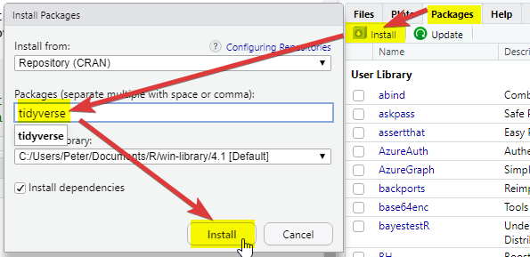
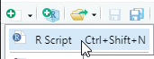
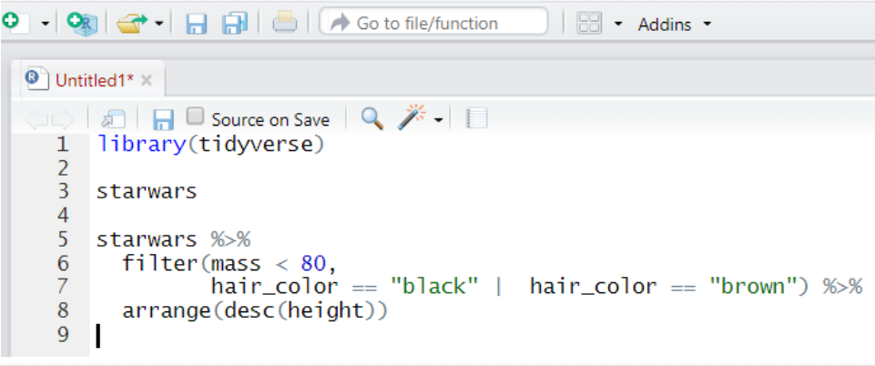
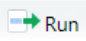
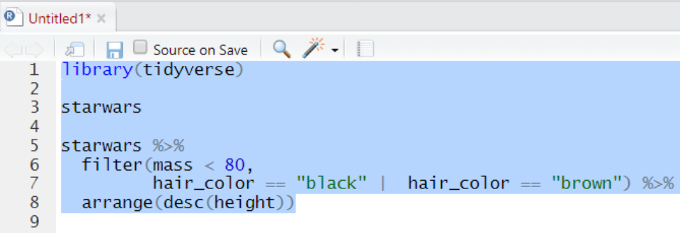
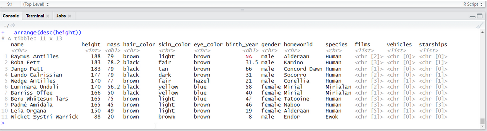
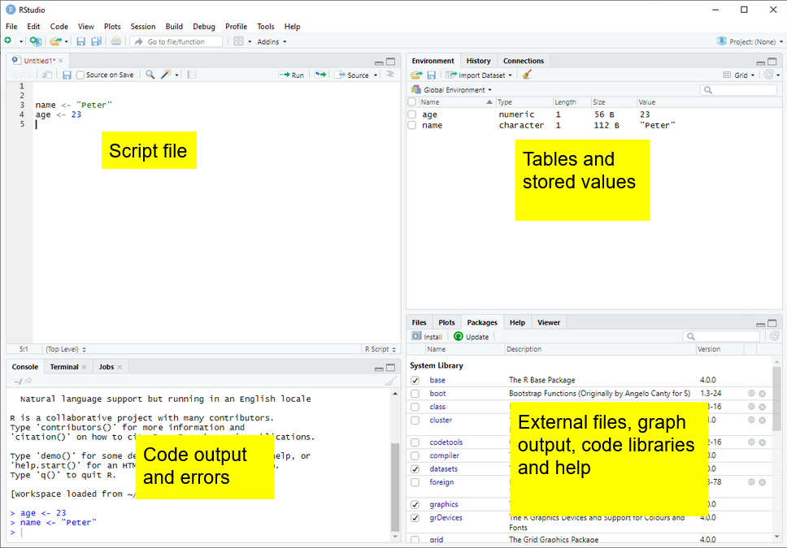

```{r setup}
```

This short course aims to take you through the process of writing your first programs in the **R statistical programming language** to analyse national and international educational datasets. To do this we will be using the **R Studio** integrated development environment (IDE), a desktop application to support you in writing R scripts. R Studio supports your programming by flagging up errors in your code as you write it, and helping you manage your analysis environment by giving you quick access to tables, objects and graphs as you develop them. In addition, we will be looking at data analysis using the **tidyverse** code packages. The tidyverse is a standardised collection of supporting code that helps you read data, tidy it into a usable format, analyse it and present your findings.

The R programming language offers similar functionality to an application based statistical tool such as SPSS, with more of a focus on you writing code to solve your problems, rather than using prebuilt tools. R is open source, meaning that it is free to use and that lots of people have written code in R that they have shared with others. R statistical libraries are some of the most comprehensive in existence. R is popular[^1] in academia and industry, being used for everything from sales modelling to cancer detection.

[^1]: As of December 2022, [Tiobe](https://www.tiobe.com/tiobe-index/) has R as the 11th most popular programming language. Many other, contradictory, ranking systems exist.

```{r}
#| warning: false
#| message: false
#| eval: true
#| echo: true

# This example shows how R can pull data directly from the internet
# tidy it and start making graphs. All within 9 lines of code
library(tidyverse)

education <- read_csv(
  "https://barrolee.github.io/BarroLeeDataSet/BLData/BL_v3_MF.csv")

education %>%
  filter(agefrom == 15, ageto == 24,
         country %in% c("Germany","France","Italy","United Kingdom")) %>%
  ggplot(aes(x=year, y=yr_sch, colour=country)) +
  geom_point() +
  geom_line()
```

Whilst it is possible to use R through menu systems and drop down tools, the focus of this course is for you to write your own R scripts. These are text files that will tell the computer how to go through the process of loading, cleaning, analysing and presenting data. The sequential and modular nature of these files makes it very easy to develop and test each stage separately, reuse code in the future, and share with others.

This booklet is written with the following sections to support you:

```{r example_code}
#| echo: true
# Code examples and questions appear like this
a <- 1 + 3
```

```{=html}
<pre><code>[1] Code output appears like this</code></pre>
```
`Courier font` indicates keyboard presses, column names, column values and function names.

`<folder>` Courier font within brackets describe values that can be passed to functions and that you need to define yourself. I.e. copying and pasting these code chunks verbatim won't work!

::: callout-note
specifies things to note
:::

::: callout-warning
gives warning messages
:::

::: callout-important
highlights issues that might break your code
:::

::: callout-tip
gives suggestions on how to do things in a better way
:::

::: question
Activities and coding tasks look like this

```{r}
#| eval: false
#| echo: true
what <- "does this"
code == "do"
```
:::

# Getting set up

## Installation (on your own machine) {#sec-installation}

1.  Install R (default settings should be fine)

    a.  **Windows** users visit: [here](https://cran.r-project.org/bin/windows/base/)
    b.  **Mac** users visit: [here](https://cran.r-project.org/bin/macosx/) and make sure you get the correct version of R for M1/2 Macs (~November 2020 onwards), or Intel Macs (~up to November 2020)

2.  Install **RStudio**, visit [here](https://rstudio.com/products/rstudio/download/#download) and it should present you with the version suitable for your operating system.

(If the above doesn't work follow the instructions [here](https://www.rstudio.com/products/rstudio/download/#download))

## Setting up RStudio and the tidyverse {#sec-packages}

1.  Open RStudio

2.  On the bottom right-hand side, select **Packages**, then select **Install**, then type **"tidyverse"** into the Packages field of the new window:

    

3.  Click Install and you should see things happening in the console (bottom left). Wait for the console activity to finish (it'll be downloading and checking packages). If it asks any questions, type `N` for no and press enter.

4.  Add a new R Script using the  button

    {width="210" height="74"}

5.  In the new R script, write the following:

    {width="514"}

6.  Select all the lines and press `Control` or `Command ⌘` and `Enter` on your keyboard at the same time. Alternatively, press the {width="36"} button

    {width="585"}

7.  Check that you have the following in the console window (depending on your screen size you might have fewer columns):

    

8. Install the `arrow` package, repeat step 2, above.

9. Download the `PISA_student_2022_subset.parquet` dataset from [here](https://emckclac-my.sharepoint.com/:u:/g/personal/k1926273_kcl_ac_uk/EUT13jrQxKJCp64WnH1MG3MBHoDqkzx1NJZIoVpUFHUYvg?e=pi2ZoD) and __download__ it on your computer, make a note of the __full folder location__ where you have saved this!

::: callout-note
If you need help with finding the full folder location of your file, often a hurdle for Mac users, go to @sec-loading-computer
:::

10. Copy the following code and replace `<folder>` with the full folder location of where your dataset was saved, make sure that you have `.parquet` on the end. And keep the `(r"[  ]")`!

```{r}
#| eval: false
#| echo: true
#| code-fold: true
#| code-summary: examples of what this should look like for PC and Mac

# For Pete (PC) the address format was:
PISA_2022 <- read_parquet(r"[C:\Users\Peter\KCL\MASTEMR\PISA_student_2022_subset.parquet]")

# For Richard (Mac) the address format was:
PISA_2022 <- read_parquet(r"[/Users/k1765032/Documents/Teaching/STEM MA/Quantitative module/Data sets/PISA_student_2022_subset.parquet]")
```

```{r}
#| eval: false
#| echo: true
library(arrow)
library(tidyverse)

PISA_2022 <- read_parquet(r"[<folder>PISA_student_2022_subset.parquet]")
```

11. Underneath the code you have already written, copy the code below (you don't have to write it yourself), and run it. Try and figure out what each line does and what it's telling you.

```{r}
#| warning: false
#| eval: false
#| echo: true
library(tidyverse)

PISA_2022 %>%
  mutate(maths_better = PV1MATH > PV1READ) %>%
  select(CNT, ST004D01T, maths_better, PV1MATH, PV1READ) %>% 
  filter(!is.na(ST004D01T), !is.na(maths_better)) %>%
  group_by(ST004D01T) %>%
  mutate(students_n = n()) %>%
  group_by(ST004D01T, maths_better) %>%
  summarise(n = n(),
            per = n/unique(students_n))
```

12.  That's it, you should be set up!

13.  Any issues, please drop a message on the Teams group, or mail [peter.kemp\@kcl.ac.uk](mailto:peter.kemp@kcl.ac.uk) and [richard.brock\@kcl.ac.uk](mailto:richard.brock@kcl.ac.uk)

# Starting to code

After adding a new R Script using the button {width="27" height="29"}, there are four parts to R Studio's interface. For the moment we are most interested in the Script file section, top left.

{width="600"}

# Your first program

## Objects and instructions

In programming languages we can attach data to a name, this is called assigning a value to an object (you might also call them *variables*). To do this in R we use the `<-` arrow command. For example, I want to put the word `"Pete"` into an object called `myname` (note that words and sentences such as `"Pete"` need speech marks):

```{r code_intro_text}
#| echo: true
myname <- "Pete"
print(myname)
```

We will see later on that variables can hold different datatypes, for example, numbers or in the case above characters. 

We can also perform quick calculations and assign them to objects:

```{r code_intro_maths}
#| echo: true
HoursInYear <- 365 * 24
print(HoursInYear) 
```

::: question
Type the two examples above into your RStudio script file and check that they work. Adapt them to say your full name and give the number of `MinutesInADay`
:::

::: callout-tip
Remember to select code and press `control` or `command` and `Enter` to run it
:::

Objects can form part of calculations, for example, the code below shows how we can use the number `HoursInYear` to (roughly!) calculate the number of `HoursInWeek`:

```{r code_intro_variables}
#| echo: true
HoursInYear <- 365 * 24

HoursInWeek <- HoursInYear / 52
print(HoursInWeek)
```

Notice from the above we can perform the main arithmetic commands using keyboard symbols: `+` (add); `-` (minus); `*` (multiply); `/` (divide); `^` (power)

Objects can change values when you run code. For example in the code below:

```{r code_intro_variables_reassignment}
#| echo: true
a <- 2000
b <- 5

a <- b

a <- a * b
print(a)
```

What's going on here?

-   line 1 sets `a` to equal 2000 (note: don't use commas in writing numbers `a <- 2,000` would bring up an error),
-   line 2 sets `b` to equal 5,
-   line 4 overwrites the value of `a` with the value stored in `b`, making object `a` now equal to 5
-   line six is now `5 * 5`

### Questions

::: question
what are the outputs of the following code snippets/what do they do? One of the examples might not output anything, why is that? Type the code into your script file to check your answers:

code example 1

```{r}
#| echo: true
#| eval: false
rabbits <- 50
feet <- 4

totalfeet <- rabbits * feet
print(totalfeet)
```

```{r}
#| code-fold: true
#| code-summary: answer
#| eval: false
#| echo: true

200
```

code example 2

```{r}
#| echo: true
#| eval: false
p <- 3.14 - 0.14
r <- 5

print(p * r^2)
```

```{r}
#| echo: true
#| code-fold: true
#| code-summary: answer
#| eval: false
75
```

code example 3

```{r}
#| echo: true
#| eval: false
tax <- 17.5
price <- 4.50
sales <- 128
tax <- 20

income <- (sales * price) * (1 + (tax/100))
```

```{r}
#| echo: true
#| code-fold: true
#| code-summary: answer
#| eval: false
# prints nothing! there isn't a print statement
```
:::

## Naming objects

Correctly naming objects is very important. You can give an object almost any name, but there are a few rules to follow:

-   Name them something sensible
-   R is case sensitive, `myName` is not equal to (`!=`) `myname`
-   Don't use spaces in names
-   Don't start a name with a number
-   Keep punctuation in object names to underscore (`_` and full stop `.`) e.g. `my_name`, `my.name`.
-   Stick to a convention for all your objects, it'll make your code easier to read, e.g.
    -   `myName`, `yourName`, `ourName` (this is *camelCase* [^3])
    -   `my_name`, `your_name`, `our_name` (this is *snake case*)

[^3]: `camelCase` has a capital letter in the front or front and middle forming the camel's hump(s), there are multiple [naming conventions](https://en.wikipedia.org/wiki/Naming_convention_(programming)), it doesn't matter which you pick, just stick to one of them.

::: callout-important
The actual name of an object has no effect on what it does (other than invalid names breaking your program!). For example `age <- "Barry"` is perfectly valid to R, it's just a real pain for a human to read.
:::

### Questions

::: question
Which of these are valid R object names:

-   `my_Number`
-   `my-Number`
-   `myNumber!`
-   `first name`
-   `FIRSTname`
-   `i`
-   `3names`
-   `names3`

```{r}
#| echo: true
#| code-fold: true
#| code-summary: answers

# my_Number  (VALID)
# my-Number  (INVALID due to -)
# myNumber!  (INVALID due to !)
# first name (INVALID due to space)
# FIRSTname  (VALID but don't recommend so many caps)
# i          (VALID)
# 3names     (INVALID starts with a 3)
# names3     (VALID)

```
:::

::: callout-note
For more information on the R programming style guide, see [this](https://style.tidyverse.org/)
:::

## Comments

Code can often look confusing and it's a good idea to add `# comments` to your code to make it more understandable for you and others. The computer ignores comments when running your code:

```{r code_intro_comments}
#| echo: true
# this calculates the average sales per shop

income1 <- 132
income2 <- 665
income3 <- 233
income4 <- 1200

shops <- 4 # everything after the hash is a comment

avgSales <- sum(income1, income2, income3, income4) / shops  

# sometimes you might want to comment out code that
# is no longer needed, but might be useful later
# standard_deviation <- sd(c(income1, income2, income3, income4) )
# the above code isn't run

print(avgSales) # but this code is
```

## Datatypes {#sec-datatypes}

We have already met two different *datatypes*, the *character* datatype for words and letters (e.g. `"Peter"`) and the *numeric* datatype for numbers (e.g. `12`). Datatypes tell R how to handle data in certain circumstances. Sometimes data will be of the wrong datatype and you will need to convert between datatypes. Common datatypes include numeric data (for numbers) and strings (for characters).

```{r code_intro_data_type_error}
#| error: true
#| echo: true
weeks <- 4
days_in_week <- "7"

# we now attempt to multiply a number by a string
# but it doesn't work!
total_days <- weeks * days_in_week 
```

Whilst R will understand what to do when we multiply numbers with numbers, it gets very confused and raises an error when we try to perform an *arithmetic* operation using *words* and *numbers*.

To perform the calculation we will need to convert the `days_in_week` from a string to a number, using the `as.numeric(<text>)` command:

```{r code_intro_data_type_convert}
#| echo: true
weeks <- 4
days_in_week <- "7"

# we now attempt to multiply a number by a string
total_days <- weeks * as.numeric(days_in_week)
```

There is a *logical* datatype for boolean values of `TRUE` and `FALSE`. This will become a lot more useful later.

```{r datatype_logical}
#| echo: true
legs_snake <- FALSE # you can specify logical values directly, without quotation marks (quotation marks round FALSE                     # would give a character data type)
dogs_legs <- 4
legs_dog <- dogs_legs > 0 # or as part of a calculation

# Do dog's have legs?
print(legs_dog)
```

There are actually three datatypes for numbers in R, `numeric` for most of your work, the rarer `integer` specifically for whole numbers and the even rarer `complex` for complex numbers. When you are looking at categorical data, `factors` are used on top of the underlying datatype to store the different values, for example you might have a field of `character` to store `countries`, factors would then list the different countries stored in this character field.

To change from one datatype to another we use the `as.____` command: `as.numeric(<text>)`, `as.logical(<data>)`, `as.character(<numeric>)`.

### Questions

::: question
1.  Can you spot the error(s) in this code and fix them so it outputs: "July is month 7"?

```{r}
#| echo: true
#| eval: false
#| class.source: "none"
month <- "July"
order <- 7
  
print(month)
Print("is")
print(month)
print("order")
```

```{r}
#| echo: true
#| code-fold: true
#| code-summary: answer
#| eval: false
month <- "July"
order <- 7
  
print(month)    
print("is")     #1 print needs a lowercase p
print("month")  #2 month is a character not an object, use speech marks
print(order)    #3 order is an object, not a character, so drop the speech marks
```

2.  Can you spot the error(s) in this code and fix it?

```{r}
#| echo: true
#| eval: false
#| class.source: "none"
a <- 7
b <- "8"
c < - 3
  
print(a + b + c)
```

```{r}
#| echo: true
#| eval: false
#| code-fold: true
#| code-summary: answer
a <- 7
b <- 8 #1 b is numeric so drop the speech marks
c <- 3 #2 the arrow needs to be together, remove the space
  
print(a + b + c)
```

3.  Can you spot the error(s) in this code and fix it?

```{r}
#| echo: true
#| eval: false
#| class.source: "none"
pass mark <- 50 
exam_grade <- 50

# did the student pass?
print(exam_grade > pass_mark)
```

```{r}
#| echo: true
#| code-fold: true
#| code-summary: answer
#| eval: false

pass_mark <- 50 #1 the variable name can't have any spaces
exam_grade <- 50

# did the student pass?
print(exam_grade >= pass_mark) # this needs to be >= as they had a passing grade
```
:::

::: callout-tip
If you want to find out the datatype of an object you can use the structure `str` command to give you more information about the object. In this instance `chr` means that `month` is of character datatype and `num` means it is of the numeric datatype.

```{r}
#| echo: true
month <- "July"
str(month)

month <- 7
str(month)
```
:::

# Vectors {#sec-vectors}

So far we have seen how R does simple calculations and prints out the results. Underlying all of this are *vectors*. Vectors are data structures that bring together one or data elements of the *same* datatype. E.g. we might have a `numeric` vector recording the grades of a class, or a `character` vector storing the gender of a set of students. To define a vector we use `c(<item>, <item>, ...)`, where `c` stands for *combine*. Vectors are very important to R[^4], even declaring a single object, `x <- 6`, is creating a vector of size one. Larger vectors look like this:

[^4]: R was created to allow for [*vector programming*](https://en.wikipedia.org/wiki/Array_programming), that is a programming language where you can apply operations to entire sets of values (vectors) at the same time, rather than having to cycle through them individually. Vector languages work in a way that is close to how mathematical notation works, making them well suited for performing mathematical functions.

```{r}
#| echo: true
#| label: vectors
maths_grade <-   c(5,    4,    4,    1,     7,     5,     8)
english_grade <- c(8,    5,    3,    2,     3,     6,     9)
genders <-      c("F",  "M",  "M",  "F",   "M",   "F",   "M")
students <-     c("Joe", "Al", "Mo", "Flo", "Olu", "Sam", "Jimmy")
```

You can quickly perform calculations across whole vectors:

```{r}
#| echo: true
# convert all genders to the lower case form
tolower(genders) 

# raise everyone's maths grade by one(!?)
maths_grade + 1
```

We can also perform calculations across vectors, in the example below we can find out which students got a better grade in Maths than in English.

```{r}
#| echo: true
# this compares each pair of values
# e.g. the first item in maths_grade (5) with
# the first item in english_grade (8)
# and so on
# This returns a logical vector of TRUE and FALSE
maths_grade > english_grade

# To work out how many students got a better grade 
# in maths than in English we can apply sum()
# to the logical vector. 
# We know that TRUE == 1, FALSE == 0,
# so sum() will count all the TRUEs
sum(maths_grade > english_grade)

# if you want to find out the average grade for
# each student in maths and english
# add both vectors together and divide by 2
(maths_grade + english_grade) / 2

# we can use square brackets to pick a value from a vector
# vectors start couting from 1, so students[1] would pick Jo
students[1]

# we can pass a numeric vector to a another vector to create a
# subset, in the example below we find the 3rd and 5th item

students[c(3,5)]

# we can also use a vector of TRUE and FALSE to pick items
# TRUE will pick an item, FALSE will ignore it
# for each maths_grade > english_grade that is TRUE
# the name in that position in the student vector will be shown
students[maths_grade > english_grade]
```

You should be careful when trying to compare vectors of different lengths. When combining vectors of different lengths, the shorter vector will match the length of the longer vector by wrapping its values around. For example if we try to combine a vector of the numbers 1 ot 10 with a two item logical vector `TRUE` `FALSE`, the logical vector will repeat 5 times: `c(TRUE, FALSE, TRUE, FALSE, TRUE, FALSE, TRUE, FALSE, TRUE, FALSE)`. We can use this vector as a *mask* to return the odd numbers, TRUE means keep, FALSE means ignore:

```{r}
#| echo: true
nums <- c(1,2,3,4,5,6,7,8,9,10)
mask <- c(TRUE, FALSE) 

# you can see the repeat of mask by pasting them together
paste(nums, mask)
# now to filter out the numbers we don't want
nums[mask]
```

This might not seem very useful, but it comes in very handy when we want to perform a single calculation across a whole vector. For example, we want to find all the students who achieved grade 5 in English, the below code creates a vector of `5`s the same size as `english_grade`:

```{r}
#| echo: true
# this can also be rewritten english_grade >= c(5)
# note, when we are doing a comparison, we need to use double ==
students[english_grade == 5]
#which is the same as
students[english_grade == c(5,5,5,5,5,5,5)]
```

::: callout-important
When we are doing a comparison, we need to use double `==` equals sign. Using a single equals sign is the equivalent of an assignment `=` is the same as `<-`
:::

::: callout-tip
There are several shortcuts that you can take when creating vectors. Instead of writing a whole sequence of numbers by hand, you can use the `seq(<start>, <finish>, <step>)` command. For example:

```{r}
#| echo: true
#| eval: false
# the step default is 1, so you can miss it from seq(1,10,1)
seq(1,10)   == c(1,2,3,4,5,6,7,8,9,10)
seq(1,10,2) == c(1,3,5,7,9)
```

This allows for some pretty short ways of solving quite complex problems, for example if you wanted to know the sum of all the [multiples of 3 and 5 below 1000](https://projecteuler.net/problem=1), you could write it like this:

```{r}
#| echo: true
#| eval: false
# the unique() command gives you the unique items in a vector
sum(unique(c(seq(3, 999, 3), seq(5, 999, 5))))
```

Another shortcut is writing `T`, `F`, or `1`, `0` instead of the whole words `TRUE`, `FALSE`:

```{r}
#| echo: true
#| eval: false
c(T, F) == c(1, 0) == c(TRUE, FALSE)
```
:::

## Questions

::: question
1.  Can you spot the *three* problems with this code:

```{r}
#| echo: true
#| eval: false
#| class.source: "none"

nums <- v(1,2,"3",4,7,2,2)
sum(nums)
mean(nums)
# return a vector of all numbers greater than 2
nums(nums >= 2)
```

```{r}
#| eval: false
#| echo: true
#| class.source: "none"
#| code-fold: true
#| code-summary: answer

nums <- c(1,2,3,4,7,2,2) 
#1 a vector is declared using c(), not v()
#2 3 should be numeric, so no need for speech marks
# (though technically R would do this conversion for you!)

sum(nums)
mean(nums)
# return a vector of all numbers greater than 2
nums[nums >= 2] #3 to pick items from another vector, use square brackets
```

2.  Create a vector to store the number of glasses of water you have drunk for each day in the last 7 days. Work out:
    -   the mean average number of glasses for the week,
    -   the total number of glasses,
    -   the number of days where you drank less than 2 glasses (feel free to replace water with your own tipple: wine, coffee, tea, coke, etc.)

```{r}
#| eval: false
#| echo: true
#| code-fold: true
#| code-summary: answer
glasses <- c(6,1,3,2,3,0,3)
mean(glasses)
sum(glasses)
sum(glasses < 2)
```

3.  Using the vectors below, create a program that will find out the average grade for females taking English:

```{r}
#| echo: true
#| eval: false
english_grade <- c(8,5,3,2,3,6,9)
genders <- c("F", "M", "M", "F", "M", "F", "M")
```

```{r}
#| eval: false
#| echo: true
#| code-fold: true
#| code-summary: answer
english_grade <- c(8,5,3,2,3,6,9)
genders <- c("F", "M", "M", "F", "M", "F", "M")
mean(english_grade[genders == "F"])

```
:::

# Summary questions

Now you have covered the basics of R, it's time for some questions to check your understanding. These questions will cover all the material you have read so far and don't be worried if you need to go back and check something. Exemplar answers are provided, but don't worry if your solution looks a little different, there are often multiple ways to achieve the same outcome.

::: question
1.  Describe three datatypes that you can use in your program?

```{r}
#| echo: true
#| code-fold: true
#| code-summary: answer
#| eval: false
print("numeric for numbers")
print("character for words/strings")
print("logical for boolean values")
```

2.  What are two reasons that you might use comments?

```{r}
#| echo: true
#| code-fold: true
#| code-summary: answer
#| eval: false
# to make your code more understandable
# to disable bits of code that you might want to reenable later

```

3.  Which object names are valid?

    -   `my_name`
    -   `your name`
    -   `our-name`
    -   `THYname`

```{r}
#| echo: true
#| code-fold: true
#| code-summary: answer
#| eval: false
# my_name - VALID
# your name - INVALID use of space
# our-name - INVALID use of hyphen
# THYname - VALID
```

4.  Can you spot the *four* errors in this code:

```{r}
#| echo: true
#| eval: false
#| class.source: "none"

stu1 <- 12
2stu <- 13
stu3 <- "15"

# now work out the average of the ages
avg < - (Stu1 + stu2 + stu3) / 3
print(avg)
```

```{r}
#| echo: true
#| code-fold: true
#| code-summary: answer
#| eval: false

stu1 <- 12
stu2 <- 13 #1 2stu to stu2, cannot start name with a number
stu3 <- 15 #2 no need for speech marks on "15"

# now work out the average of the ages
avg <- (stu1 + stu2 + stu3) / 3 #3 broken arrow < - #4 capital letter on Stu1
print(avg)
```

5.  \[Extension\] Calculate the number of seconds since 1970.

```{r}
#| echo: true
#| code-fold: true
#| code-summary: answer
#| eval: false
this_year <- 2022
focus_year <- 1970

(this_year - focus_year) * 365 * 24 * 60 * 60
```
:::

# Packages and libraries

R comes with some excellent statistical tools, but often you will need to supplement them with packages[^5] . Packages contain functionality that isn't built into R by default, but you can choose to load or install them to meet the needs of your tasks. For example you have code packages to deal with SPSS data, and other packages to run machine learning algorithms. Nearly all R packages are free to use!

[^5]: You'll sometimes see the words package and library used interchangeably, technically the *library* is the place where the *packages* are stored.

## Installing and loading packages {#sec-load-run-pckges}

To install a package you can use the package tab in the bottom right-hand panel of RStudio and follow the steps from @sec-packages. Alternatively you can install things by typing:

```{r}
#| echo: true
#| eval: false
install.packages("tidyverse")
```

Note that the instruction is to install package**s**, you can pass a vector of package names to install multiple packages at the same time:

```{r}
#| echo: true
#| eval: false
install.packages(c("tidyverse","readxl","haven"))
```

Once a package is installed it doesn't mean that you can use it, yet. You will need to *load* the package. To do this you need to use the `library(<package_name>)` command, for example:

```{r}
#| echo: true
#| eval: false
library(tidyverse)
```

::: callout-important
Some packages might use the same function names as other packages, for example `select` might do different things depending on which package you loaded last. As a rule of thumb, when you start RStudio afresh, make sure that you load the `tidyverse` package after you have loaded all your other packages. To read more about this problem see @sec-QANDA
:::