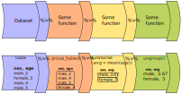

```{r setup}
```

Piping allows us to break down complex tasks into manageable chunks that can be written and tested one after another. There are several powerful commands in the tidyverse as part of the *dplyr* package that can help us `group`, `filter`, `select`, `mutate` and `summarise` datasets. With this small set of commands we can use piping to convert massive datasets into simple and useful results.

Using the pipe `%>%` command, we can feed the results from one command into the next command making for reusable and easy to read code.

{fig-align="center"}

::: callout-note
The pipe command we are using `%>%` is from the *magrittr* package which is installed alongside the tidyverse. Recently *R* introduced another pipe `|>` which offers very similar functionality and tutorials online might use either. The examples below use the `%>%` pipe.
:::

Let's look at an example of using the pipe on the `PISA_2022` table to calculate the best performing OECD countries for maths `PV1MATH` by gender `ST004D01T`:

```{r}
#| warning: false
#| echo: true
PISA_2022 %>%                                         # <1>
  filter(OECD == "Yes") %>%                           # <2>
  group_by(CNT, ST004D01T) %>%                        # <3>
  summarise(mean_maths = mean(PV1MATH, na.rm=TRUE),   # <4>
            sd_maths = sd(PV1MATH, na.rm=TRUE),       # <4>
            students = n()) %>%                       # <4>
  filter(!is.na(ST004D01T)) %>%                       # <5>
  arrange(desc(mean_maths))                           # <6>
```

1.  line 1 passes the whole `PISA_2022` dataset and pipes it into the next line using `%>%`
2.  line 2 `filters` out any results that are from non-OECD countries by finding all the rows where `OECD` equals `==` "Yes", this is then piped to the next line
3.  line 3 groups the data by country `CNT` and by student gender `ST004D01T`, this is then piped to the next line
4.  line 4-6 the `summarise` command performs a calculation on the country and gender groupings returning three new columns, each command is described by code on a new line and separated by a comma: the mean value for maths `mean_maths`, the standard deviation `sd_maths`, and a column telling us how many students were in each grouping using the `n()` which returns the number of rows in a group. These new columns and the grouping columns are then piped to the next line, all other columns are dropped
5.  line 7 filters out any gender `ST004D01T` that is `NA`. First is finds all the students that have `NA` as their gender by using `is.na(ST004D01T)`, then it *NOTs*/flips the result using the exclamation mark `!`, giving those students who don't have their gender set to `NA`. The filtered data is then piped to the next line
6.  line 8, finally we `arrange`/sort the results in `desc`ending order by the `mean_maths` column. The default for arrange is *ascending* order, leave out the `desc(  )` for the numbers to be ordered in the opposite way.

Across the top few countries, Males get a slightly better maths score `PV1MATH` than Females, other scores are available, please read @sec-PV to find out more about the limitations of using a "PV" value.

::: callout-note
we met the assignment command earlier `<-`. Within the tidyverse commands we use the equals sign instead `=`.
:::

The commands we have just used come from a package within the `tidyverse` called `dplyr`, let's take a look at what they do:

| command   | purpose                                                 | example                                 |
|------------------------|------------------------|------------------------|
| select    | reduce the dataframe to the fields that you specify     | `select(<field>, <field>, <field>)`     |
| filter    | get rid of rows that don't meet one or more criteria    | `filter(<field> <comparison>)`          |
| group     | group fields together to perform calculations           | `group_by(<field>, <field>))`           |
| mutate    | add new fields or change values in current fields       | `mutate(<new_field> = <field> / 2)`     |
| summarise | create summary data optionally using a grouping command | `summarise(<new_field> = max(<field>))` |
| arrange   | order the results by one or more fields                 | `arrange(desc(<field>))`                |

::: callout-note
If you want to explore more of the functions of `dplyr`, take a look at the [helpsheet](https://www.rstudio.com/wp-content/uploads/2015/02/data-wrangling-cheatsheet.pdf)
:::

::: question
Adjust the code above to find out the lowest performing countries for reading `PV1READ` by gender that are not in the OECD

```{r}
#| eval: false
#| code-fold: true
#| code-summary: answer
#| echo: true
PISA_2022 %>% 
  filter(OECD == "No") %>%
  group_by(CNT, ST004D01T) %>% 
  summarise(mean_read = mean(PV1READ, na.rm=TRUE),
            sd_read = sd(PV1READ, na.rm=TRUE),
            students = n()) %>%
  filter(!is.na(ST004D01T)) %>%
  arrange(mean_read)
```
:::

# select

The `PISA_2022` dataset has far too many fields, to reduce the number of fields to focus on just a few of them we can use `select`

```{r}
#| echo: true
PISA_2022 %>% 
  select(CNT,ESCS, ST004D01T, ST003D02T)
```

You might also be in the situation where you want to select everything but one or two fields, you can do this with the negative signal `-`, the below code returns all the fields *except* `CNT` and `OECD`:

```{r}
#| echo: true
PISA_2022 %>% select(-CNT, -OECD)
```

You might find that you have a vector of column names that you want to select, to do this, we can use the `any_of` command:

```{r}
#| echo: true
my_fields <- c("CNT", "CNTSCHID", "ST004D01T")
PISA_2022 %>% select(any_of(my_fields))
```

With hundreds of fields available, you might want to focus on fields whose names match a certain pattern, to do this you can use `starts_with`, `ends_with`, `contains`:

```{r}
#| echo: true
# country of birth of student, and father and mother are recorded in ST019___
PISA_2022 %>% select(starts_with("ST019"))
```

When you come to building your statistical models you often need to use *numeric* data, you can find the columns that have only numbers in them by the following. Be warned though, sometimes there are numeric fields which have a few words in them, so R treats them as characters. Use the PISA [codebook](https://webfs.oecd.org/pisa2022/CY08MSP_CODEBOOK_5thDecember23.xlsx) to help work out where those numbers are.

```{r}
#| echo: true
PISA_2022 %>% select(where(is.numeric)) %>% names()
```

::: callout-tip
If you do want to change the type of a column to numeric you are going to need to:

-   `filter` out any offending rows, and
-   `mutate` the column to be numeric: `col = as.numeric(col)`
:::

## Questions

::: question
1.  Spot the three errors with the following `select` statement

```{r}
#| eval: false
#| echo: true
PISA_2022 
  select(CNT BELONG) %>%
```

```{r}
#| eval: false
#| echo: true
#| code-fold: true
#| code-summary: answer
PISA_2022 %>%  #1 missing pipe
  select(CNT, BELONG) #2 no comma between column names, #3 stray pipe on end
```

2.  Write a `select` statement to display the month `ST003D02T` and year of birth `ST003D03T` and the gender `ST004D01T` of each student.

```{r}
#| eval: false
#| echo: true
#| code-fold: true
#| code-summary: answer
PISA_2022 %>% 
  select(ST003D02T, ST003D03T, ST004D01T)
```

3.  Write a `select` statement to show all the fields that are to do with well being and health, e.g. `WB150Q01HA` "How is your health?"

```{r}
#| eval: false
#| echo: true
#| code-fold: true
#| code-summary: answer
PISA_2022 %>% 
  select(starts_with("WB15"))
```

4.  \[EXTENSION\] Adjust your answer to Q3 so that you select the gender `ST004D01T` and the ID `CNTSTUID` of each student in addition to the `ST254____` fields looking at digital devices in the home:

```{r}
#| eval: false
#| echo: true
#| code-fold: true
#| code-summary: answer
PISA_2022 %>% 
  select(CNTSTUID, ST004D01T, starts_with("ST254")) %>% na.omit()
```
:::

# filter

Not only does the `PISA_2022` dataset have a huge number of columns, it has hundred of thousands of rows. We want to `filter` this down to the students that we are interested in, i.e. filter out data that isn't useful for our analysis. If we only wanted the results that were `Male`, we could do the following:

```{r}
#| echo: true
PISA_2022 %>% 
  select(CNT, ESCS, ST004D01T, ST003D02T, PV1MATH) %>%
  filter(ST004D01T == "Male")
```

We can combine `filter` commands to look for `Males` born in `September` and where the `PV1MATH` figure is greater than `750`. We can list multiple criteria in the filter by separating the criteria with commas, using commas mean that all of these criteria need to be `TRUE` for a row to be returned. A comma in a filter is the equivalent of an `AND`, :

```{r}
#| echo: true
PISA_2022 %>% 
  select(CNT, ESCS, ST004D01T, ST003D02T, PV1MATH) %>%
  filter(ST004D01T == "Male",
         ST003D02T == "September",
         PV1MATH > 750)
```

You can also write it as an ampersand `&`

```{r}
#| echo: true
#| eval: false
PISA_2022 %>% 
  select(CNT, ESCS, ST004D01T, ST003D02T, PV1MATH) %>%
  filter(ST004D01T == "Male" &
         ST003D02T == "September" &
         PV1MATH > 750)
```

::: callout-important
Remember to include the `==` sign when looking to filter on equality; additionally, you can use `!=` (not equals), `>=`, `<=`, `>`, `<`.

Remember matching is case sensitive, "september" `!=` "September"
:::

Rather than just looking at September born students, we want to find all the students born in the Autumn term. But if we add a couple more criteria on `ST003D02T` nothing is returned! Why?

```{r}
#| echo: true
PISA_2022 %>% 
  select(CNT, ESCS, ST004D01T, ST003D02T, PV1MATH) %>%
  filter(ST004D01T == "Male",
         ST003D02T == "September",
         ST003D02T == "October",
         ST003D02T == "November",
         ST003D02T == "December",
         PV1MATH > 750)
```

The reason is R is looking for individual students born in September `AND` October `AND` November `AND` December. As a student can only have one birth month there are no students that meet this criteria. We need to use `OR` :

To create an `OR` in a filter we use the bar `|` character, the below looks for all students who are "Male" `AND` were born in "September" `OR` "October" `OR` "November" `OR` "December", `AND` have a `PV1MATH` \> 750.

```{r}
#| echo: true
PISA_2022 %>% 
  select(CNT, ESCS, ST004D01T, ST003D02T, PV1MATH) %>%
  filter(ST004D01T == "Male",
         (ST003D02T == "September" | ST003D02T == "October" | ST003D02T == "November" | ST003D02T == "December"),
         PV1MATH > 750)
```

It's neater, maybe, to use the `%in%` command, which checks to see if the value in a column is present in a vector, this can mimic the `OR`/`|` command:

```{r}
#| echo: true
#| eval: false
PISA_2022 %>% 
  select(CNT, ESCS, ST004D01T, ST003D02T, PV1MATH) %>%
  filter(ST004D01T == "Male",
         ST003D02T %in% c("September", "October", "November", "December"),
         PV1MATH > 750)
```

::: callout-tip
When building filters you need to know the range of values that a column can take, we can do this in several ways:

```{r}
#| echo: true
# show the possible levels
levels(PISA_2022$ST003D02T)

# show the actual unique values in a field
# this might be a slightly smaller set of values
unique(PISA_2022$ST003D02T)

# You might also want to read the label of a field
attr(PISA_2022$ST003D02T, "label")
```
:::

```{r}
#| echo: false
#| eval: false
# TODO: add simple debug on single filter ==
# TODO: add simple question on single filter ==
```

## Questions

::: question
1.  Spot the **two** errors with the following `select` statement

```{r}
#| echo: true
#| eval: false
PISA_2022
  select(CNT, PV1READ) %>%
  filter(CNT = "Finland")
```

```{r}
#| echo: true
#| eval: false
#| code-fold: true
#| code-summary: answer
PISA_2022 %>%  #1 missing pipe command
  select(CNT, PV1READ) %>%
  filter(CNT == "Finland") #2 you need a double equals
```

2.  Use `filter` to find all the students with `PV1READ` grade  equal to 333.

```{r}
#| echo: true
#| eval: false
#| code-fold: true
#| code-summary: answer
PISA_2022 %>% 
  filter(PV1READ == 333)
```

3.  Use `filter` to find all the students with `PV1READ`, `PV1SCIE`, and `PV1MATH` grades over 800.

```{r}
#| echo: true
#| eval: false
#| code-fold: true
#| code-summary: answer
PISA_2022 %>% 
  filter(PV1READ > 800,
         PV1SCIE > 800,
         PV1MATH > 800)
```

4.  Spot the **three** errors with the following `select` statement

```{r}
#| echo: true
#| eval: false
PISA_2022 %>% 
  select(CNT) %>%
  filter(CNT in c("France", "belgium")
         ESCS < 0)
```

```{r}
#| echo: true
#| eval: false
#| code-fold: true
#| code-summary: answer
PISA_2022 %>% 
  select(CNT, ESCS) %>% #1 you have ESCS in the filter, it needs to be in the select as well
  filter(CNT %in% c("France", "Belgium"), #2 Belgium needs a capital letter
                                          #3 the %in% command needs percentages
                                          #4 you need a comma (or &) at the end of the line
         ESCS < 0)

```

5.  Use `filter` to find all the students with `Three or more` cars in their home `ST251Q01JA`. How does this compare to those with no `None` cars?

```{r}
#| echo: true
#| eval: false
#| code-fold: true
#| code-summary: answer
# cars 3+ 
PISA_2022 %>%
  select(CNT, ST251Q01JA) %>%
  filter(ST251Q01JA == "Three or more")

# cars 0
PISA_2022 %>%
  select(CNT, ST251Q01JA) %>%
  filter(ST251Q01JA == "None")
```

6.  Adjust your code in Q5. to find the number of students with `Three or more` cars in their home `ST251Q01JA` in `Italy`, how does this compare with `Spain`?

```{r}
#| echo: true
#| eval: false
#| code-fold: true
#| code-summary: answer
PISA_2022 %>%
  select(CNT, ST251Q01JA) %>%
  filter(ST251Q01JA == "Three or more",
         CNT == "Italy")

PISA_2022 %>%
  select(CNT, ST251Q01JA) %>%
  filter(ST251Q01JA == "Three or more",
         CNT == "Spain")

# EXTENSION:
# Note we would need to know the percentage of students 
# in each country with that number of cars to make a proper
# comparison. Spain might have more students taking the PISA
# test than Italy, or vice-versa

PISA_2022 %>%
  select(CNT, ST251Q01JA) %>%
  filter(CNT %in% c("Italy", "Spain")) %>%
  group_by(CNT) %>%
  mutate(total_stus = n()) %>%
  filter(ST251Q01JA == "Three or more") %>%
  summarise(three_more = n(),
            per_three_more = three_more/unique(total_stus))
```

7.  Write a `filter` to create a table for the number of `Female` students with reading `PV1READ` scores lower than 400 in the `United Kingdom`, store the result as `read_low_female`, repeat but for `Male` students and store as `read_low_male`. Use `nrow()` to work out if there are more males or females with a low reading score in the UK

```{r}
#| echo: true
#| eval: false
#| code-fold: true
#| code-summary: answer
read_low_female <- PISA_2022 %>% 
  filter(CNT == "United Kingdom",
         PV1READ < 400,
         ST004D01T == "Female")

read_low_male <- PISA_2022 %>% 
  filter(CNT == "United Kingdom",
         PV1READ < 400,
         ST004D01T == "Male")

nrow(read_low_female)
nrow(read_low_male)

# You could also pipe the whole dataframe into nrow()
PISA_2022 %>% 
  filter(CNT == "United Kingdom",
         PV1READ < 400,
         ST004D01T == "Female") %>% 
  nrow()
```

8.  How many students in the United Kingdom had no television `ST254Q01JA` *OR* no connection to the internet `ST250Q05JA`. **HINT**: use `levels(PISA_2022$ST254Q01JA)` to look at the levels available for each column.

```{r}
#| echo: true
#| eval: false
#| code-fold: true
#| code-summary: answer
PISA_2022 %>% filter(CNT == "United Kingdom", 
                     ST254Q01JA == "None" |
                     ST250Q05JA == "None")
```

9.  Which countr\[y\|ies\] had students with `NA` for Gender, remember to check for `NA` using `is.na()`?

```{r}
#| echo: true
#| eval: false
#| code-fold: true
#| code-summary: answer
PISA_2022 %>% 
  filter(is.na(ST004D01T)) %>%
  select(CNT) %>%
  distinct()
```
:::

# renaming columns {#sec-renaming}

Very often when dealing with datasets such as PISA or TIMSS, the column names can be very confusing without a reference key, e.g. `ST004D01T`, `OCOD3` and `ST261Q04JA`. To rename columns in the tidyverse we use the `rename(<new_name> = <old_name>)` command. For example, if you wanted to rename the rather confusingly named student column for *gender*, also known as `ST004D01T`, and the column for having a *having enough digital resources* in school, also known as `IC172Q01JA`, you could use:

```{r}
#| echo: true
PISA_2022 %>%
  rename(gender = ST004D01T,
         dig_resources = IC172Q01JA) %>%
  select(CNT, gender, dig_resources) %>% 
  summary()
```

If you want to change the name of the column so that it stays when you need to perform another calculation, remember to *assign* the renamed dataframe back to the original dataframe. But be warned, you'll need to reload the full dataset to restore the original names:

```{r}
#| echo: true
#| eval: false
PISA_2022 <- PISA_2022 %>%
    rename(gender = ST004D01T,
           dig_resources = IC172Q01JA)
```

# group_by and summarise

So far we have looked at ways to return rows that meet certain criteria. Using `group_by` and `summarise` we can start to analyse data for different groups of students. For example, let's look at the number of students who don't have internet connections at home besides a mobile phone `ST250Q05JA`:

```{r}
#| echo: true
PISA_2022 %>%                 # <1>
  group_by(ST250Q05JA) %>%    # <2>
  summarise(student_n = n())  # <3>
```

1.  Line 1 passes the full `PISA_2022` to the pipe
2.  Line 2 makes groups within `PISA_2022` using the unique values of `ST250Q05JA`
3.  Line 3, these groups are then passed to `summarise`, which creates a new column called `student_n` and stores the number of rows in each `ST250Q05JA` group using the `n()` command. `summarise` only returns the columns it creates, or are in the `group_by`, everything else is discarded.

What we might want to do is look at this data from a country by country perspective, by adding another field to the `group_by()` command, we then group by the unique combination of countries `CNT` and internet access `ST250Q05JA`, e.g. Albania + Yes; Albania + No; Albania + NA; United Arab Emirates + Yes; etc

```{r}
#| echo: true
#| warning: false
int_by_cnt <- PISA_2022 %>% 
  group_by(CNT, ST250Q05JA) %>%
  summarise(student_n = n())

print(int_by_cnt)
```

`summarise` can also be used to work out statistics by grouping. For example, if you wanted to find out the `max`, `mean` and `min` science grade `PV1SCIE` by country `CNT`, you could do the following:

```{r}
#| echo: true
#| warning: false
PISA_2022 %>% 
  group_by(CNT) %>%
  summarise(sci_max  = max(PV1SCIE,  na.rm = TRUE),
            sci_mean = mean(PV1SCIE, na.rm = TRUE),
            sci_min  = min(PV1SCIE,  na.rm = TRUE))
```

::: callout-important
`group_by()` can have unintended consequences in your code if you are saving your pipes to new dataframes. To be safe your can clear any grouping by adding: `my_data %>% ungroup()`
:::

## Questions

::: question
1.  Spot the **three** errors with the following `summarise` statement

```{r}
#| echo: true
#| eval: false
PISA_2022 %>% 
  group(CNT)
  summarise(num_stus = n)
```

```{r}
#| echo: true
#| eval: false
#| code-fold: true
#| code-summary: answer
PISA_2022 %>% 
  group_by(CNT) %>% #1 group_by NOT group #2 missing pipe %>%
  summarise(num_stus = n()) #3 = n() not = n
```

2.  Write a `group_by` and `summarise` statement to work out the `mean` and `median` cultural capital value `ESCS` for each student by country `CNT`

```{r}
#| echo: true
#| eval: false
#| code-fold: true
#| code-summary: answer

PISA_2022 %>%
  group_by(CNT) %>%
  summarise(escs_mean = mean(ESCS, na.rm=TRUE),
            escs_median = median(ESCS, na.rm=TRUE))
```

3.  Using `summarise` work out, `Yes` or `No`, by country `CNT` and gender `ST004D01T`, whether students "Agree/disagree: There are enough \[digital resources\] for every student at my school" `IC172Q01JA`. Filter out any `NA` values on `IC172Q01JA`:

```{r}
#| echo: true
#| eval: false
#| code-fold: true
#| code-summary: answer
PISA_2022 %>% 
  filter(!is.na(IC172Q01JA)) %>%
  group_by(CNT, ST004D01T, IC172Q01JA) %>% 
  summarise(n=n())
  
```
:::

# mutate {#sec-mutate}

Sometimes you will want to adjust the values stored in a field, e.g. converting a distance in miles into kilometres; or compute a new fields based on other fields, e.g. working out a total grade given the parts of a test. To do this we can use `mutate`. Unlike `summarise`, `mutate` retains all the other columns either adding a new column or changing an existing one

> `mutate(<field> = <field_calculation>)`

The `PISA_2022` dataset has results for maths `PV1MATH`, science `PV1SCIE` and reading `PV1READ`. We could combine these to create an overall `PISA_grade`, and `PISA_mean`:

```{r}
#| echo: true
PISA_2022 %>%                                       
  mutate(PV1_total = PV1MATH + PV1SCIE + PV1READ,   # <1>
         PV1_mean = PV1_total/3) %>%                # <2>
  select(CNT, ST004D01T, ESCS, PV1_total, PV1_mean) # <3>
```

1.  `mutate` creates a new field called `PV1_total` made up by adding together the columns for maths, science and reading. Each column acts like a vector and adding them together is the equivalent of adding each students individual grades together, row by row. See @sec-vectors for more details on vector addition.
2.  inside the same `mutate` statement, we take the `PV1_total` calculated on line two and divide it by 3, to give us a mean value, this is then assigned to a new column, `PV1_mean`.
3.  this line `select`s only the fields that we are interested in, dropping the others

We can use `mutate` to create subsets of data in fields. For example, if we wanted to see how many students in each country were high performing readers, specified by getting a reading grade of greater than `550`, we could do the following:

```{r}
#| echo: true
#| warning: false
PISA_2022 %>%
  mutate(PV1READ_high = PV1READ > 550) %>%  # <2>
  group_by(CNT, PV1READ_high) %>%           # <3>
  summarise(n = n())                        # <4>
```

2.  this line creates a new column called `PV1READ_high` for every students, storing a boolean value, `TRUE` or `FALSE` depending on whether their reading grates `PV1READ` \> 550.
3.  a grouping is made on the country and the new field `PV1READ_high`, e.g. Albania + TRUE, Albania + FALSE, etc.
4.  using summarise we can find the number of student rows in each grouping using `n()`, and drop all the other fields

Comparisons can also be made between different columns, if we wanted to find out the percentage of Males and Females that got a better grade in their maths test `PV1MATH` than in their reading test `PV1READ`:

```{r}
#| echo: true
#| warning: false
PISA_2022 %>%
  mutate(maths_better = PV1MATH > PV1READ) %>%                # <2>
  select(CNT, ST004D01T, maths_better, PV1MATH, PV1READ) %>%  # <3>
  filter(!is.na(ST004D01T), !is.na(maths_better)) %>%         # <4>
  group_by(ST004D01T) %>%                                     # <5>
  mutate(students_n = n()) %>%                                # <6>
  group_by(ST004D01T, maths_better) %>%                       # <7>
  summarise(n = n(),                                          # <8>
            per = n/unique(students_n))                       # <9>
```

2.  `mutate` creates a new field called `maths_better` made up by comparing the `PV1MATH` grade with `PV1READ` and creating a boolean/logical vector for the column.
3.  `select`s a subset of the columns
4.  `filter`s out any students that don't have gender data `ST004D01T` *and* where the calculation on line 2 failed, i.e. `PV1MATH` or `PV1READ` was `NA`
5.  `group` on the gender of the student
6.  using the `group` on line 5, use `mutate` to calculate the total number of Males and Females by looking for the number of rows in each group `n()`, store this as `students_n`
7.  re-`group` the data on gender `ST004D01T` and whether the student is better at maths than reading `maths_better`
8.  count the number of students, `n` in each group specified by line 7.
9.  create a percentage figure for the number of students in each grouping given by line 7. Use the `n` value from line 8 and the `students_n` value from line 6. **NOTE:** we need to use `unique(students_n)` to return just one value for each grouping rather than a value for every row of the line 7 grouping

For more information on how to `mutate` fields using `ifelse`, see @sec-ifelse

# arrange

The results returned by pipes can be huge, so it's a good idea to store them in objects and explore them in the Environment window where you can sort and search within the output. There might also be times when you want to order/`arrange` the outputs in a particular way. We can do this quite easily in the tidyverse by using the `arrange(<column_name>, <column_name>)` function.

```{r}
#| echo: true
PISA_2022 %>%
  select(CNT, ST004D01T, PV1MATH) %>%
  arrange(PV1MATH)
```

If we're interested in the highest achieving students we can add the `desc()` function to `arrange`:

```{r}
#| echo: true
PISA_2022 %>%
  select(CNT, LANGN, ST004D01T, PV1MATH) %>%
  arrange(desc(PV1MATH))
```

# Bring everyting together

We know that the [evidence](https://educationendowmentfoundation.org.uk/education-evidence/teaching-learning-toolkit/repeating-a-year) strongly indicates that repeating a year is not good for student progress, but how do countries around the world differ in terms of the percentage of their students who repeat a year?

```{r}
#| echo: true
#| eval: false
#| warning: false
data_repeat <- PISA_2022 %>%                        # <1>
  filter(!is.na(REPEAT)) %>%                        # <2>
  group_by(CNT) %>%                                 # <3>
  mutate(total = n()) %>%                           # <4>
  select(CNT, REPEAT, total) %>%                    # <5>
  group_by(CNT, REPEAT) %>%                         # <6>
  summarise(student_n = n(),                        # <7>
            total = unique(total),                  # <8>
            per = student_n / unique(total)) %>%    # <9>
  filter(REPEAT == "Repeated at lease once") %>%    # <10>
  arrange(desc(per))                                # <11>

print(data_repeat)                                  

write_csv(data_repeat, "<folder_location>/repeat_a_year.csv") # <12>
```

1.  uses the `PISA_2022` dataframe, note that this line includes `<-` to store the result opf the piping into a new object called `data_repeat`
2.  `filter` out any `NA` values in the `REPEAT` field
3.  group on the country of student `CNT`
4.  create a new column `total` for total number of rows `n()` in each country `CNT` grouping
5.  select on the `CNT`, `REPEAT` and `total` columns
6.  regroup the data on country `CNT` and whether a student has repeated a year `REPEAT`, i.e. Albania+Did not repeat a grade; Albania+Repeated a grade; etc.
7.  using the above grouping, count the number of rows in each group `n()` and assign this to `student_n`
8.  for each grouping keep the `total` number of students in each country, as calculated on line 4. Note: `unique(total)` is needed here to return a single value of `total`, rather than a value for each student in each country
9.  using `student_n` from line 7 and the number of students per country `total`, from line 4, create a percentage `per` for each grouping
10. as we have percentages for both `Repeated at lease once` and `Never repeated`, we only need to display one of these.
11. finally, we sort the data on the per/percentage column, to show the countries with the highest level of repeating a grade. This data is self-recorded by students, so might not be totally reliable!
12. save the data to your own folder as a csv

```{r}
#| eval: true
#| echo: false
#| warning: false
data_repeat <- PISA_2022 %>%
  filter(!is.na(REPEAT)) %>%
  group_by(CNT) %>%
  mutate(total = n()) %>%
  select(CNT, REPEAT, total) %>%
  group_by(CNT, REPEAT) %>%
  summarise(student_n = n(),
            total = unique(total),
            per = student_n / unique(total)) %>%
  filter(REPEAT == "Repeated at lease once") %>%
  arrange(desc(per))

print(data_repeat)
```

# Advanced topics

## Recoding data (ifelse) {#sec-ifelse}

Often we want to plot values in groupings that don't yet exist, for example might want to give all schools over a certain size a different *colour* from others schools, or flag up students who have a different home language to the language that is being taught in school. To do this we need to look at how we can *recode* values. A common way to recode values is through an `ifelse` statement:

> `ifelse(<statement(s)>, <value_if_true>, <value_if_false>)`

`ifelse` allows us to *recode* the data. In the example below, we are going to add a new column to the `PISA_2022` dataset (using `mutate`) noting whether a student got a higher grade in their Maths `PV1MATH` or Reading `PV1READ` tests. **if** `PV1MATH` is bigger then `PV1READ`, the `maths_better` is `TRUE`, **else** `maths_better` is `FALSE`, or in `dplyr` format:

```{r}
#| echo: true
maths_data <- PISA_2022 %>%
  mutate(maths_better = 
           ifelse(PV1MATH > PV1READ,
                  TRUE, 
                  FALSE)) %>%
  select(CNT, ST004D01T, maths_better, PV1MATH, PV1READ)

print(maths_data)
```

We now take this new dataset `maths_data` and look at whether the difference between relative performance in maths and reading is the same for girls and boys:

```{r}
#| echo: true
#| warning: false
maths_data %>% 
  filter(!is.na(ST004D01T), !is.na(maths_better)) %>%
  group_by(ST004D01T, maths_better) %>%
  summarise(n = n()) 
```

```{r}
#| echo: false
#| eval: false
# TODO: include this as an ifelse section
avg_score <- PISA_2022 %>% 
  select(CNT, PV1MATH, PV1READ, PV1SCIE, WORKPAY) %>% 
  group_by(CNT) %>%
  mutate(STU_REL_SCORE = scale((PV1MATH + PV1READ + PV1SCIE)/3)) %>%
  mutate(WORKPAY = 
           case_when(WORKPAY == "No work for pay" ~ 0,
                     WORKPAY == "1 time of working for pay per week" ~ 1,
                     WORKPAY == "2 times of working for pay per week" ~ 2,
                     WORKPAY == "3 times of working for pay per week" ~ 3,
                     WORKPAY == "4 times of working for pay per week" ~ 4,
                     WORKPAY == "5 times of working for pay per week" ~ 5,
                     WORKPAY == "6 times of working for pay per week" ~ 6,
                     WORKPAY == "7 times of working for pay per week" ~ 7,
                     WORKPAY == "8 times of working for pay per week" ~ 8,
                     WORKPAY == "9 times of working for pay per week" ~ 9,
                     WORKPAY == "10 or more times of working for pay per week" ~ NA,
                    .default = NA)) %>%
  filter(!is.na(WORKPAY))

ggplot(data = avg_score,
       aes(x=factor(WORKPAY), y=STU_REL_SCORE)) +
  geom_violin() +
  geom_boxplot(width=0.5, outlier.shape = NA) +
  ggtitle("How working affects student scores across the world") +
  xlab("Number of times worked per week") +
  ylab("Student average score normalised relative to own country") +
  geom_smooth(aes(x=WORKPAY, y=STU_REL_SCORE), method = "lm", level=0.95)

```

::: question
Adjust the code above to work out the percentages of Males and Females `ST004D01T` in each group. Check to see if the pattern also exists between science `PV1SCIE` and reading `PV1READ`:

```{r}
#| code-fold: true
#| code-summary: adding percentage column
#| echo: true
#| eval: false
#| warning: false
PISA_2022 %>%
  mutate(maths_better = 
           ifelse(PV1MATH > PV1READ,
                  TRUE, 
                  FALSE)) %>%
  select(CNT, ST004D01T, maths_better, PV1MATH, PV1READ) %>% 
  filter(!is.na(ST004D01T), !is.na(maths_better)) %>%
  group_by(ST004D01T) %>%
  mutate(students_n = n()) %>%
  group_by(ST004D01T, maths_better) %>%
  summarise(n = n(),
            per = n/unique(students_n))
```

```{r}
#| code-fold: true
#| code-summary: comparing science and reading
#| echo: true
#| eval: false
#| warning: false
PISA_2022 %>%
  mutate(sci_better = 
           ifelse(PV1SCIE > PV1READ,
                  TRUE, 
                  FALSE)) %>%
  select(CNT, ST004D01T, sci_better, PV1SCIE, PV1READ) %>% 
  filter(!is.na(ST004D01T), !is.na(sci_better)) %>%
  group_by(ST004D01T) %>%
  mutate(students_n = n()) %>%
  group_by(ST004D01T, sci_better) %>%
  summarise(n = n(),
            per = n/unique(students_n))

```

```{r}
#| code-fold: true
#| code-summary: comparing science and maths
#| echo: true
#| eval: false
#| warning: false
PISA_2022 %>%
  mutate(sci_better = 
           ifelse(PV1SCIE > PV1MATH,
                  TRUE, 
                  FALSE)) %>%
  select(CNT, ST004D01T, sci_better, PV1SCIE, PV1MATH) %>% 
  filter(!is.na(ST004D01T), !is.na(sci_better)) %>%
  group_by(ST004D01T) %>%
  mutate(students_n = n()) %>%
  group_by(ST004D01T, sci_better) %>%
  summarise(n = n(),
            per = n/unique(students_n))

```
:::

`ifelse` statements can get a little complicated when using factors (see: @sec-factors). Take this example. Let's flag students who have a different home language `LANGN` to the language that is being used in the PISA assessment tool `LANGTEST_QQQ`. We make an assumption here that the assessment tool will be the language used at school, so these students will be learning in a different language to their mother tongue. **if** `LANGN` equals `LANGTEST_QQQ`, the `lang_diff` is `FALSE`, **else** `lang_diff` is `TRUE`, this raises an error:

```{r}
#| error: TRUE
#| echo: true

lang_data <- PISA_2022 %>%
  mutate(lang_diff = 
           ifelse(LANGN == LANGTEST_QQQ,
                  FALSE, 
                  TRUE)) %>%
  select(CNT, lang_diff, LANGTEST_QQQ, LANGN)
```

The levels in each field are different, i.e. the range of home languages is larger than the range of test languages. To fix this, all we need to do is change the datatype of the factors `LANGN` and `LANGTEST_QQQ` to characters using `as.character(<field>)`. This will then allow the comparison of the text stored in each row:

```{r}
#| echo: true
lang_data <- PISA_2022 %>%
  mutate(lang_diff = 
           ifelse(as.character(LANGN) == as.character(LANGTEST_QQQ),
                  FALSE, 
                  TRUE)) %>%
  select(CNT, lang_diff, LANGTEST_QQQ, LANGN)

print(lang_data)
```

We can now look at this dataset to get an idea of which countries have the largest percentage of students learning in a language other than their mother tongue:

```{r}
#| echo: true
#| warning: false
lang_data_diff <- lang_data %>% 
  group_by(CNT) %>%
  mutate(student_n = n()) %>%
  group_by(CNT, lang_diff) %>%
  summarise(n = n(),
            percentage = 100*(n / max(student_n))) %>%
    filter(!is.na(lang_diff),
         lang_diff == TRUE)

print(lang_data_diff)
```

This looks like a promising dataset, but there are some strange results:

```{r}
#| echo: true
lang_data_diff %>% filter(percentage > 92)
```

Exploring data for Ukraine, we can see that a different spelling has been used in each field, *Ukra*<u>i</u>nian and *Ukranain*, an incorrect spelling.

```{r}
#| echo: true
lang_data %>% filter(CNT == "Ukrainian regions (18 of 27)")
```

`ifelse` can help here too. If we pick the spelling we want to stick to, we can *recode* fields to match:

```{r}
#| echo: true
lang_data %>% 
  mutate(LANGTEST_QQQ = 
           ifelse(as.character(LANGTEST_QQQ) == "Ukranian",
                 "Ukrainian",
                 as.character(LANGTEST_QQQ))) %>%
  mutate(lang_diff = 
           ifelse(as.character(LANGN) == as.character(LANGTEST_QQQ),
                  FALSE, 
                  TRUE)) %>%
  filter(CNT == "Ukrainian regions (18 of 27)")
```

Unfortunately, if you explore this dataset a little further, the language fields don't conform well with each other and a lot more work with `ifelse` will be needed before you could put together any full analysis around students who speak different languages at home and at school.

```{r}
#| eval: false
#| echo: false
# recode needed
# Slovenian ISCED2 -> Slovenian
# Arabic <- Arabic (including Lebanese)
# filter(LANGN != "Missing",
#        LANGTEST_QQQ != "Invalid") %>%
# ST022Q01TA - What language do you speak at home most of the time?
# LANGTEST_COG	Language of Assessment
```

::: callout-tip
It's possible to nest our `ifelse` statements, by writing another `ifelse` where you would have the `<value_if_false>`, for example we might want to give describe the type of school in England:

```{r}
#| echo: true
#| eval: false
# TODO: use PISA for this
plot_data <- schools %>% 
  mutate(sch_type = 
           ifelse(EstablishmentGroup == "Special schools", "Special",
                  ifelse(EstablishmentGroup == "Independent schools", "Independent",
                         ifelse(AdmissionsPolicy=="Selective", 
                                "Grammar", "Comprehensive"))))
```
:::

## Factors and statistical data types {#sec-factors}

The types of variable will heavily influence what statistical analysis you can perform, e.g. you'll need numeric values for a t-test. R is there to help by assigning datatypes to each field. We have different sorts of data that can be stored:

<!-- https://www150.statcan.gc.ca/n1/edu/power-pouvoir/ch8/5214817-eng.htm -->

-   **Categorical** - data that can be divided into groups or categories
    -   **Nominal** - categorical data where the order isn't important, e.g. gender, or colours
    -   **Ordinal** - categorical data that may have order or ranking, e.g. exam grades (A, B, C, D) or Likert scales (strongly agree, agree, disgaree, strongly disagree)
-   **Numeric** - data that consists of numbers
    -   **Continuous** - numeric data that can take any value within a given range, e.g. height (178cm, 134.54cm)
    -   **Discrete** - numeric data that can take only certain values within a range, e.g. number of children in a family (0,1,2,3,4,5)

But here we are going to look at how R handles `factors`. Factors have two parts, `levels` and `codes`. levels are what you see when you view a table column, codes are an underlying order to the data. Factors allow you to store data that has a known set of values that you might want to display in an order other than alphabetical. For example, if we look at the month field `ST003D02T` using the `levels(<field>)` command:

```{r}
#| echo: true
levels(PISA_2022$ST003D02T)
```

We can see that the months of the year are there along with other possible `levels`. With this particular column there are levels for missing or wrong responses ("Valid Skip", "Not Applicable" "Invalid", "No Response"), though PISA rarely uses them. You are more likely to find that missing/wrong data items are coded as `NA`, as you can see below:

```{r}
#| echo: true
#| eval: true
PISA_2022 %>% count(ST003D02T)
```

`Codes` are the underlying numbers/order for each level, in this case `1 = January`, `2 = February`, etc. R stores factors as codes, then uses the `levels` to display the data. You can see the *codes* by using the `as.numeric` command on a factor:

```{r}
#| echo: true
as.numeric(PISA_2022$ST003D02T)
```

How can this be useful? Firstly it's more efficient for R to store data this way, numbers (codes) are smaller and easier to sort/search than text (levels). But it also helps when we come to presenting data. A good example is how plots are made, they will use the `codes` to give an order to the display of columns, in the plot below, `February` (`2`) comes before `August` (`8`), even though there were more students born in `August` and *A* is before *F* in the alphabet:

```{r}
#| echo: true
grph_data <- PISA_2022 %>% 
         group_by(ST003D02T) %>% 
         summarise(n=n())

grph_data %>% arrange(desc(n)) %>% pull(ST003D02T)

ggplot(data=grph_data, aes(x=ST003D02T, y=n)) + 
  geom_bar(stat = "identity") +
  theme(axis.text.x = element_text(angle = 45, hjust = 1))
```

To re-order the columns to match the number of students in each month, we can either try to do this manually, which is rather cumbersome:

```{r}
#| echo: true
my_levels <- c("September", "October", "August", "July", "May", "June", 
               "January", "March", "November", "December", "April", "February",
               "Valid Skip", "Not Applicable", "Invalid", "No Response")

grph_data$ST003D02T <- factor(grph_data$ST003D02T, levels=my_levels)

ggplot(data=grph_data, aes(x=ST003D02T, y=n)) + 
  geom_bar(stat = "identity")+
  theme(axis.text.x = element_text(angle = 45, hjust = 1))

```

Or we can get R to do this for us:

```{r}
#| echo: true
# get the levels in order and pull/create a vector of them
my_levels <- grph_data %>% arrange(desc(n)) %>% pull(ST003D02T)

# reassign the re-ordered levels to the dataframe column
grph_data$ST003D02T <- factor(grph_data$ST003D02T, levels=my_levels)

ggplot(data=grph_data, aes(x=ST003D02T, y=n)) + 
  geom_bar(stat = "identity")
```

To learn a lot more about factors, see [Hadley's chapter](https://r4ds.had.co.nz/factors.html)

# Seminar tasks

## Student dataset

::: question
1.  How many unique values are there in the `OCOD3` field for student intended future occupation? How does the most desired career vary by gender?

```{r}
#| echo: true
#| eval: false
#| code-fold: true
#| code-summary: answer

PISA_2022$OCOD3 %>% unique() %>% length()

PISA_2022 %>% 
  group_by(ST004D01T, OCOD3) %>%
  summarise(n =n()) %>%
  arrange(desc(n))
```

2.  write code to work out the `mean` and `median` `PV1MATH` score for each country `CNT`.

```{r}
#| echo: true
#| eval: false
#| code-fold: true
#| code-summary: answer

PISA_2022 %>% 
  group_by(CNT) %>%
  summarise(mean_PV1MATH = mean(PV1MATH, na.rm=TRUE),
            median_PV1MATH = median(PV1MATH, na.rm=TRUE)) %>%
  arrange(desc(median_PV1MATH))
```

3.  what is the fourth most popular language at home `LANGN` spoken by students in schools in the `Ireland`, how does this compare to `Germany`?

```{r}
#| echo: true
#| eval: false
#| code-fold: true
#| code-summary: answer

PISA_2022 %>% 
  filter(CNT %in% c("Germany", "Ireland")) %>%
  group_by(CNT, LANGN) %>%
  summarise(n = n()) %>%
  arrange(desc(n))
```

4.  Spot the **five** errors with the following code. Can you make it work? What does it do?

```{r}
#| echo: true
#| eval: false

# Work out when science scores are better than maths
PISA_2022_scimath < PISA_2022 %>%
  rename(gender = ST004D01T) %>%
  mutate(sci better = PV1SCIE - PV1MATH) %>%
  filter(is.na(scibetter) %>%
  group_by(CNT gender) %>%
  summarise(students = n,
            sci_win = sum(scibetter >= 0),
            per_scibetter = 100*(sci_win/students))
```

```{r}
#| echo: true
#| eval: false
#| code-fold: true
#| code-summary: answer

# Work out when more time spent in language lessons than maths lessons
PISA_2022_scimath <- PISA_2022 %>%  #1 make sure you have the assignment arrow <-
  rename(gender = ST004D01T) %>%
  mutate(sci_better = PV1MATH - PV1SCIE) %>% #2 _ not space in name of field
  filter(!is.na(sci_better)) %>%  #3 this needs to be !is.na, otherwise it'll return nothing
  group_by(CNT, gender) %>% #4 missing comma
  summarise(students = n(),   #5 missing brackets on the n() command
            sci_win = sum(sci_better >= 0),
            per_sci_win = 100*(sci_win/students))
```

5.  By country and gender work out the mean, median and standard deviations of `STUBMI`, order by the descending `mean`.

```{r}
#| echo: true
#| eval: false
#| code-fold: true
#| code-summary: answer
pisa_bmi <- PISA_2022 %>%
  rename(gender = ST004D01T) %>%
  group_by(CNT, gender) %>%
  summarise(n=n(),
            bmi_mean = mean(STUBMI, na.rm=TRUE),
            bmi_median = median(STUBMI, na.rm=TRUE),
            bmi_sd = sd(STUBMI, na.rm=TRUE)) %>%
  arrange(desc(bmi_mean))
```
:::

## Teacher dataset

To further check your understanding of this section you will be attempting to analyse the 2022 teacher dataset. This dataset includes records for `r nrow(PISA_2022_teacher)` teachers from `r length(unique(PISA_2022_teacher$CNT))` countries, including `r ncol(PISA_2022_teacher)` columns, covering attitudinal, demographic and workplace data. You can find the dataset [here](https://emckclac-my.sharepoint.com/:u:/g/personal/k1926273_kcl_ac_uk/EbFmgVVbQD9DlIIgOKHDhLcB8bA8lfQMDVSEkcjtByM2cQ?e=zYG4Is) in the `.parquet` format.

```{r}
#| echo: true
#| eval: false
#| code-fold: true
#| code-summary: example loading code

# download the file then
# Work out when more time spent in language lessons than maths lessons
PISA_2022_teacher <- read_parquet("C:/Users/Peter/Downloads/PISA_2012_teacher.parquet")
```

::: question
1.  Work out how many teachers are in the dataset for `Portugal`

```{r}
#| echo: true
#| eval: false
#| code-fold: true
#| code-summary: answer

PISA_2022_teacher %>% 
  group_by(CNTRYID) %>%
  summarise(n=n()) %>%
  filter(CNTRYID == "Portugal")
```

2.  For each country `CNTRYID` by gender `TC001Q01NA`, what is the `mean` time that a teacher has been in the teaching profession `TC007Q02NA`? Include the number of teachers in each group. Order this to show the country with the longest serving workforce:

```{r}
#| echo: true
#| eval: false
#| code-fold: true
#| code-summary: answer

PISA_2022_teacher %>%
  group_by(CNTRYID, TC001Q01NA) %>%
  summarise(avg_years = mean(TC007Q02NA, na.rm=TRUE),
            n = n()) %>%
  arrange(desc(avg_years))

```

3.  For each country `CNT` find out which teachers report that they 'Help students think critically' `TC199Q07HA`. Hin: you'll need to look at the levels of this question to find the correct filter:

```{r}
#| echo: true
#| eval: false
#| code-fold: true
#| code-summary: answer

crit_thinking <- PISA_2022_teacher %>% 
  rename(crit_think = TC199Q07HA) %>%
  group_by(CNT) %>%
  mutate(teachers=n()) %>%
  group_by(CNT, crit_think) %>%
  summarise(n = n(),
            per = n()/unique(teachers)) %>%
  arrange(desc(per)) %>%
  filter(crit_think == "A lot")

# interestingly the highest performing countries also 
# have some of the lowest scores in helping children 
# think critically. To plot this:

left_join(crit_thinking,
          PISA_2022 %>% group_by(CNT) %>% summarise(maths = mean(PV1MATH))) %>%
  ggplot(aes(x=per, y=maths)) + 
  geom_point() +
  geom_smooth()
```

4.  Explore the data on use of technology in the classroom `TC169____`

```{r}
#| echo: true
#| eval: false
#| code-fold: true
#| code-summary: answer

PISA_2022_teacher %>% select(CNT, TC001Q01NA, starts_with("TC169"))
```

5.  Save the results of one of the above questions using `write_csv()`.

6.  \[EXTENSION\] explore the dataset and find out some more interesting facts to share with your group
:::
