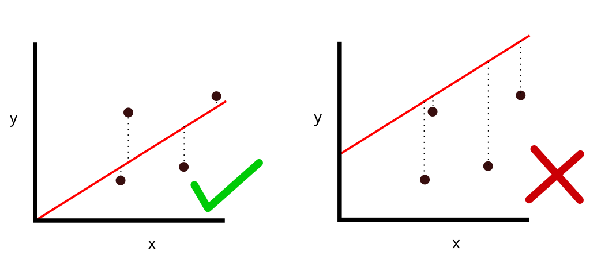
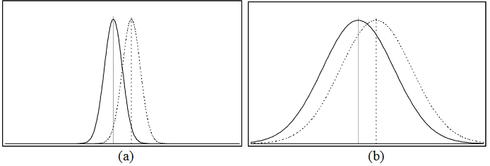

```{r setup}
#| eval: true
#| warning: false
#| echo: false

# only load this code if testing this file independently of overall project
if(!exists("test")){
  warning("RUNNING LOCAL FILE LOAD")
  
  library(glue)
  proj_folder <- "C:/Users/Peter/Google Drive/Kings/Code/MASTEMR/"
  proj_folder <- r"(/Users/k1765032/Google Drive/My Drive/MASTEMR/)"
  
  node <- Sys.info()
  if(node["nodename"] == "KCLJ7J6LFC74J"){ #Richard's PC
    proj_folder <- r"(/Users/k1765032/Google Drive/My Drive/MASTEMR/)"
  }else if(node["nodename"] == "KCL3Y7NKR3"){ #Pete's NEW Laptop
    proj_folder <- r"(G:\My Drive\Kings\Code\MASTEMR\)"
  }else if(node["nodename"] == "PETES_PC"){ #Pete's NEW Laptop
    base_location <- "C:\\github\\mastemr\\"
    proj_folder <- "C:\\github\\mastemr\\"
  }else if(node["nodename"] == "Amys-MacBook-Air.local"){ #Amy's NEW Laptop
    proj_folder <- r"(/Users/amyobrien/Google Drive/My Drive/MASTEMR/)"
}
  source(glue("{proj_folder}MASTEMR_setup.R"))
}
```

```{=html}
<!-- Correlation 
https://docs.google.com/presentation/d/1QlXhCOaFMRyg8IJ2JczKkpjx26eS9BRi/edit#slide=id.p1-->
```
```{=html}
<!-- Correlation 
https://docs.google.com/presentation/d/1QlXhCOaFMRyg8IJ2JczKkpjx26eS9BRi/edit#slide=id.p1
@mikk2016relationships

DOCTR slides
https://docs.google.com/presentation/d/1j2IhhnBSrg0sM4HuUE5thO0rMLz2W48scylbdPOmAlo/edit#slide=id.p 
-->
```
# Pre-reading and pre-session tasks
## Pre-reading
## Pre-session task

# Correlation and linear regression

In this session we will be exploring the use of **linear regression** to describe data and predict results. We will be looking for patterns within the PISA data sets, as well we trying to recreate some of the controversial findings from @stoet2018gender by linking `PISA_2018` data to global gender equality indices using the `left_join` function.

There are two types of statistics that we can create:

**Descriptive statistics** describe/summarise a data set. E.g. what's the average height of a woman, how many people called George were born in Somerset each year since 1921?

**Inferential statistics** estimate something from a set of data, make generalisations about larger populations. E.g. If I know the height of a woman, can I predict her shoe size? If I meet someone called George, what is the likelihood that they were born in Somerset?

The first few sessions of this course taught you how to use R to perform descriptive statistics, with you finding the `mean`, `max`, `min` etc of data. Following sessions have given you a range of inferential tools, for example chi-square, t-tests and ANOVA. This session will introduce you to *linear regression* a means by which you can predict the value of a variable based on the value of another variable. Before we can start using linear regression we will introduce you to *correlation*, another type of inferential statistics.

# Correlation

Correlation gives the direction and strength of the relationship between two numeric variables. For example we might see a relationship between the reading level of a student and their maths results in the UK: the better a student is at reading, typically, the higher their maths grade. Correlation allows us to describe this relation statistically:

```{r}
#| echo: true
#| code-fold: true
#| code-summary: code
#| warning: false

corr_data <- PISA_2022 %>% 
  filter(CNT == "United Kingdom") %>% 
  select(PV1MATH, PV1READ, ST004D01T)

corr <- cor.test(corr_data$PV1MATH, corr_data$PV1READ, method = "pearson")
corr_est <- signif(corr[["estimate"]],4)


ggplot(data = corr_data, aes(PV1MATH, PV1READ)) +
  geom_point(alpha=0.1) + 
  geom_smooth(method="lm", se = FALSE) +
  geom_text(label=paste("r = ", corr_est), aes(x=700,y=-4.5))
```

The graph above shows that there is a correlation between Maths score and Reading score. This relationship is a *positive* one, i.e. as the reading level of an individual increases the maths grade is also likely to increase. The strength, *correlation coefficient* (`Pearson's r`) of the relationship between these two numeric fields is `r corr_est`. The correlation coefficient runs from -1 to +1.

```{r}
#| echo: false
# correlation coefficients

# positive
coef_data <- map(c(1:100),
    ~{
      n <- runif(1, min=0, max=50)
      c(.x,.x + n)
    }) %>% as.data.frame() %>% t() %>% 
  as.data.frame() %>% 
  unname()

names(coef_data) <- c("x", "y")
rownames(coef_data) <- NULL

corr <- cor.test(coef_data$x, coef_data$y, method = c("pearson"))
corr_est <- format(round(corr[["estimate"]],2), nsmall = 2)

coef_graph_data <- coef_data %>% mutate(relationship = "positive", r = corr_est)

# negative
coef_data <- map2(c(1:100),seq(100,1,-1),
    ~{
      n <- runif(1, min=0, max=50)
      c(.x,.y + runif(1, min=-5, max=5))
    }) %>% as.data.frame() %>% t() %>% 
  as.data.frame() %>% 
  unname()

names(coef_data) <- c("x", "y")
rownames(coef_data) <- NULL

corr <- cor.test(coef_data$x, coef_data$y, method = c("pearson"))
corr_est <- format(round(corr[["estimate"]],2), nsmall = 2)

coef_graph_data <- rbind(coef_graph_data, coef_data %>% mutate(relationship = "negative", r = corr_est))

# none
coef_data <- map(c(1:500),
    ~{
      n <- runif(1, min=0, max=1)
      n <- n * if_else(runif(1, min=0, max=2) >= 1, -1, 1)
      # c(.x,n)
      c(runif(1, min=10, max=110),
        runif(1, min=10, max=110))
      
      
      
    }) %>% as.data.frame() %>% t() %>% 
  as.data.frame() %>% 
  #mutate(V1 = V1 / 10,
  #       V2 = V2 + 50) %>% 
  unname() 

names(coef_data) <- c("x", "y")
rownames(coef_data) <- NULL

corr <- cor.test(coef_data$x, coef_data$y, method = c("pearson"))
corr_est <- format(round(corr[["estimate"]],2), nsmall = 2)

coef_graph_data <- rbind(coef_graph_data, coef_data %>% 
                     mutate(relationship = "none-negligible", 
                            r = corr_est))
```

-   If the correlation coefficient (r) is _negative_, i.e. as one factor increase the other declines, the slope of the line of best-fit will be negative. E.g "The more time you spend running on a treadmill, your body mass decreases"
-   If the correlation coefficient (r) is _positive_, i.e. as one factor increase the other increases, the slope of the line of best-fit will be positive. E.g. "As the temperature increases, more icecreams are purchased."
-   If the correlation coefficient (r) is 0, i.e one factor increasing doesn't impact the other factor, the slope of the line of best-fit will be flat. E.g. "the number of trees in a city has no relation to the number of chocolate bars purchased by children"

```{r}
#| echo: false
#| warning: false
#| fig-height: 3
# graph of correlation coefficients

ggplot(data = coef_graph_data, aes(x, y)) +
  geom_point(alpha=0.3) + 
  geom_smooth(method="lm", se = FALSE) +
  geom_text(aes(label=paste("r = ", r),x=max(x) *0.8,y=min(y))) +
  ylab("") + xlab("") +
  facet_wrap(relationship ~ .)
```

To run the correlation test in R we use the `cor.test` function:

`cor.test(<vector1>, <vector2>, method = "pearson")`

For our data we will be using the `PV1MATH` and `PV1READ` columns.

```{r}
#| echo: true
#| warning: false
cor.test(corr_data$PV1MATH, corr_data$PV1READ, method = "pearson")
```

-   `df` the number of ways that the data can vary, the larger this number the more ways the data could have been different
-   `p-value` significance of the result, we can dismiss the null-hypothesis that there isn't a relationship between maths score and wealth as the p-value is less than `0.05`
-   `sample estimates` the strength of the relationship between the factors
-   `confidence intervals` the upper and lower limit of where the correlation coefficient is likely to lie, with 95% confidence.

::: callout-note
Degrees of freedom (`df`)

Two individuals from different countries might have a weight difference of 5 kg. So what?! But if *average* weights between *whole* populations of countries vary by 5 kg then this becomes much more interesting.

Roughly: The number of independent values that can vary without questioning the significance of the model. So the more `df` you have, the safer your model. Degrees of freedom can be calculated by looking at the number of values that can vary, often this is the number of observations that you have minus one -- if you had just one element it wouldn't be able to vary against anything else.
:::

## Other correlation-coefficients

When looking for correlations in data that is *non-parametric*, i.e. not normally distributed you could use *Spearman's rank order correlation-coefficient (rho ρ)* rather than *Pearson's r*. `cor.test(... method = "...")` allows you to specify the `method` used for correlation, you can set this to Spearman's rho by writing `method = "spearman"`

Data will need to contain continuous or ordinal variables. The Spearman correlation coefficient is based on the *ranked* values for each variable rather than the raw data. The Spearman correlation between two variables is equal to the Pearson correlation between the rank values of those two variables.

We want to look at the correlation between students self-efficacy in digital competencies  (`ICTEFFIC`) and wealth (`HOMEPOS`) for students in the the UK. To make the data set manageable, let us examine girls whose mother or father is a software developer

```{r}
#| echo: true
# create a data set for the UK, including the HOMEPOS and ICTEFFIC variables
sub_data <- PISA_2022 %>% 
              select(CNT, HOMEPOS, ICTEFFIC, ST004D01T, OCOD1, OCOD2) %>%
              filter(CNT == "United Kingdom") %>%
              filter(ST004D01T == "Female") %>%
              filter(OCOD1 == "Software developers" | OCOD2 == "Software developers")
```

It is unclear if `ICTEFFIC`, self-efficacy in digital competencies, is _normalised_. We can graph it with `geom_density` to find out:

```{r}
#| echo: true
ggplot(sub_data) + 
  geom_density(aes(x=ICTEFFIC))
```

The data doesn't look very normal.

We can run the *Shapiro-Wilk Test* to check for the the normality of the data, any alpha value greater than `0.05` means we can assume that the data is normally distributed.

```{r}
#| echo: true
shapiro.test(sub_data$ICTEFFIC)
```

In this case the data *isn't* normally distributed as `p < 0.05` and we need to use a non-parametric correlation test. We need to run *Spearman* rather than *Pearson*:

```{r}
#| echo: true
#| warning: false
cor.test(sub_data$HOMEPOS, sub_data$ICTEFFIC, method = "spearman")
```

The result shows no significant correlation (`p=0.5459`) between wealth and IT self-efficacy for girls who home at least one parent who is a software developer

```{r}
#| warning: false
#| echo: false
#| eval: false
cor.test(sub_data$HOMEPOS, sub_data$ICTEFFIC, method = "pearson")
```

```{r}
#| echo: false
#| eval: false
sub_data <- PISA_2022 %>% 
              select(CNT, HOMEPOS, ICTEFFIC, ST004D01T, OCOD1, OCOD2) %>%
              filter(CNT == "United Kingdom") %>%
              filter(ST004D01T == "Female") %>%
              filter(OCOD1 == "Software developers" | OCOD2 == "Software developers")


cor.test(sub_data$HOMEPOS, sub_data$ICTEFFIC, method = "spearman")
cor.test(sub_data$HOMEPOS, sub_data$ICTEFFIC, method = "pearson")

# get different job roles
# tmp <- PISA_2018 %>% 
#                 filter(CNT == "United Kingdom",
#                        ST004D01T == "Female") %>%
#   group_by(OCOD2) %>% count() %>% arrange(desc(n))


num_flds <- PISA_2022 %>% select(where(is.numeric)) %>% names()

shaps <- map(num_flds,
    ~{
      shapiro.test(sub_data[[.x]])[["p.value"]]
    })
names(shaps) <- num_flds
sub_data$ATTLNACT

ggplot(sub_data) + geom_point(aes(x=ICTEFFIC, y=PV1SCIE))
```

## Checking the assumptions of the model

For you to conduct the correct correlation test you need to be sure that the data meet several criteria. First, as noted above, the data should be _normally distributed_ for a pearson test to be conducted. You can check the __normality__ of the data using the `shapiro.test` function and/or by graphing the data. For large data sets such as PISA (n > 5,000), the `shapiro.test` won't work and you might want to use the graph to check; alternatively you can also use the *central limit theorem*, which means that when you have a sufficiently large sample you can presume that the data is normally distributed [@field2012discovering]. As a rule of thumb *"30 is the magic number"*, and any samples you are studying with 30 or more data items can be treated as parametric, e.g. you could use _pearson_ when running correlation analysis on 30 or more items. This is a rough rule of thumb and you should always check the normality of your data before when checking and presenting any result any tests.

You also need to expect a _linear relationship_ between the two variables. For example, if you were to plot the data and it looked like a curve, you might want to use a different test. You can use the `ggplot` function to plot the data and see if it looks linear. The graph below shows data that doesn't appear to be linearly related.

```{r}
x <- seq(0, 2 * pi, length.out = 100)  # X-values from 0 to 2*pi
y <- runif(200, sin(x + runif(1, min = -1, max = 0.5)))  # Y-values as sine of x

ggplot(data = data.frame(x = x, y = y), aes(x = x, y = y)) + geom_point()
```

The data should be of paired observations. If you have missing data in one of the variables you should remove the missing data from the other variable using `na.omit()` e.g.:

```{r}
#| echo: true
#| eval: false
PISA_2015 <- PISA_2015 %>% select(PV1MATH, PV1SCIE) %>% na.omit()
```

When dealing with non-parametric and small data sets you can also use **Kendall's Tau** i.e. `cor.test(... method = "kendall")`

## Reporting correlations

To interpret the correlation co-efficient of a model we can use the following table:

| Correlation co-efficient | Relationship         |
|--------------------------|----------------------|
| .70 or higher            | very strong positive |
| .40 to .69               | strong positive      |
| .30 to .39               | moderate positive    |
| .20 to .29               | weak positive        |
| .01 to .19               | negligible or none   |
| 0                        | no relationship      |
| -.01 to -.19             | negligible or none   |
| -.20 to -.29             | weak negative        |
| -.30 to -.39             | moderate negative    |
| -.40 to -.69             | strong negative      |
| -.70 or higher           | very strong negative |

When writing a report we might present our findings like this:

> There was no significant relationship between the perceived quality of sleep and its impact on Mood, *r* = -.12, *p* = .17

or

> There is a significant very strong correlation between overall well-being and life satisfaction, *r* = .86, *p* = .00

## Questions: Correlation

::: question
Use `cor.test` to explore the following relationships:

1.  `PV1MATH` to `PV1SCIE`, is this a stronger relationship than that between Maths and Reading? Why might they be different?

```{r}
#| echo: true
#| code-fold: true
#| code-summary: answer
#| eval: false
cor.test(PISA_2022$PV1MATH, PISA_2022$PV1SCIE, method = "pearson")
#> cor 0.8888601

cor.test(PISA_2022$PV1MATH, PISA_2022$PV1READ, method = "pearson")
#> cor 0.8312513

#> very slightly, yes!
```

2.  How does the correlation of wealth `HOMEPOS` of females `ST004D01T` and their Reading `PV1READ` scores compare to males? Why might they be different?

```{r}
#| echo: true
#| code-fold: true
#| code-summary: answer
#| eval: false

data <- PISA_2022 %>% filter(ST004D01T == "Female")
cor.test(data$HOMEPOS, data$PV1READ, method = "pearson")
#> 0.4972371 

data <- PISA_2022 %>% filter(ST004D01T == "Male")
cor.test(data$HOMEPOS, data$PV1READ, method = "pearson")
#> cor 0.4216684 
```

3.  How does life satisfaction `ST016Q01NA` correlate with the science score of students?

```{r}
#| echo: true
#| code-fold: true
#| code-summary: answer
#| eval: false
cor.test(PISA_2022$ST016Q01NA, PISA_2022$PV1SCIE, method = "pearson")
#> -0.06439345
#> there is negligible or no correlation between these variables
```

4. How does parental involvement in education `PARINVOL` correlate with reading outcomes for students in Germany (__HINT:__ you might want to check the normality of this data!):

```{r}
#| echo: true
#| code-fold: true
#| code-summary: answer
#| eval: false

mdl_data <- PISA_2022 %>%
  mutate(gender = ST004D01T) %>%
  filter(!is.na(PARINVOL),
         CNT == "Germany") %>%
  select(CNT, gender, PARINVOL, PV1READ)

shapiro.test(mdl_data$PARINVOL)
#> not normally distributed!
#> W = 0.96017, p-value < 2.2e-16
ggplot(mdl_data) + 
  geom_density(aes(x=PARINVOL))

shapiro.test(mdl_data$PV1READ)
#> not normally distributed!
#W = 0.99362, p-value = 4.224e-08
ggplot(mdl_data) + 
  geom_density(aes(x=PV1READ))

#> as the data isn't normally distributed we need to use a non-parametric test, i.e. spearman's rho
cor.test(mdl_data$PARINVOL, mdl_data$PV1READ, method = "spearman")
#> p-value < 2.2e-16
#> rho -0.2962208

# or as a graph
ggplot(mdl_data, aes(x=PARINVOL, y=PV1READ)) + 
  geom_point() +
  geom_smooth(method="lm")
```

5. Using the _full_ [PISA data set](https://emckclac-my.sharepoint.com/:u:/g/personal/k1926273_kcl_ac_uk/EQwPwPa-bzBFp1ne6LlrT0MBSh_q-YSKzFb2Jp8ybcwztQ?e=cNcFNw), for the `United Kingdom` How does the sense of belonging to school `BELONG` correlate with the item that measures bullying `BULLIED`? How does the UK compare against other countries?

```{r}
#| echo: true
#| code-fold: true
#| code-summary: answer
#| eval: false
data <- PISA_2022 %>% filter(CNT == "United Kingdom")
cor.test(data$BELONG, data$BULLIED, method = "pearson")
#> -0.3797393
#> there is a moderate negative correlation between these variables,
#> students who are bullied less have a greater sense of belonging												  
```

:::

::: callout-tip
If you want to find all the `numeric` fields, i.e. the fields that you can easily run correlation calculations on, use the following code to list them:

```{r}
#| echo: true
PISA_2022 %>% select(where(is.numeric)) %>% names()
```
:::


# Regression

Correlation allows us to see the strength of the relationship but it doesn't allow us to *predict* what would happen if a variable changed. "When the wind blows, the trees move. When the trees move, the wind blows." Which is it? Correlation suggests there is a link but tells us nothing about causation. To do this we need *regression*.

| Correlation                                                                             | Regression                                                                            |
|-----------------------------------------------------------------------------------------|---------------------------------------------------------------------------------------|
| an example of inferential statistics                                                    | an example of inferential statistics                                                  |
| give direction and strength of the relationship between two (or more) numeric variables | give direction and strength of the relationship between two (or more) variables       |
| Relationship between variables                                                          | The extent to which one variable [predicts]{.underline} another                       |
| Effect only (no cause)                                                                  | Cause and effect                                                                      |
| p(x,y) == p(y,x)                                                                        | One way (e.g. education affects income differently from how income affects education) |
| Single point/value                                                                      | An equation that creates a best fitting line                                          |

: differences and similarities between correlation and regression

Regression is a way of *predicting* the value of one *dependent* variable from one or more *independent* variables by creating a hypothetical model of the relationship between them.

-   **independent variable(s)** - the cause of the change that is independent of other variables
-   **dependent variable** - the effect of the cause

For example we could have a model that predicts the value of a house - the _dependent_ variable - based on the number of bedrooms, the size of the garden, and the distance from the city centre - the _independent_ variables.

For regression to work we need to have a large enough sample size, the means to explain any relationships, and relationships that are not spurious, i.e. that it is not due to third variables. For example....

## Linear models and regression

The model used is a **linear** one, therefore, we describe the relationship using the equation of a straight line. In linear regression, with one dependent and one independent variable, we use the *Method of Least Squares* to find the line of best fit. The means finding a straight line that passes as close as possible to all the points. The distance between a point and this line is called a _residual_. The line of best fit is the line where the sum of the residuals squared is the smallest number possible.



The line that is created can be described by the equation:

`Output = Intercept + Coefficient * Input` <!--F-statistic = a measure of the ratio of the variation explained by the model and the variation attributable to unsystematic factors (the error of the model).-->

Let's use linear regression to explore the relationship between the score in maths(`PV1MATH`) and the score in reading (`PV1READ`). To build this model we use the `lm` command:

`lm(<dependent_var> ~ <independent_var> , data=<dataframe>)`

The first part defines the model we are going to explore, listing the dependent variable and separating it from the independent variable\[s\] with a tilde `~`. You can specify multiple independent variables by adding more plusses, but for the example here we are only going to use one. Once the model has been built we can feed it into the `summary(<mdl>)` command to output the results:

```{r}
#| echo: true
#| eval: true
mdl_math_read <- lm(PV1MATH ~ PV1READ, data=PISA_2022)
summary(mdl_math_read)
```

If you look at the `Coefficents:` table we can see that `PV1READ` is significant in explaining the outcome of the model as the p-value `Pr(>|t|)` is less than 0.001 `<2e-16 ***`. The null hypothesis is that one variable does not predict another, we can dismiss this. By looking at the `Estimate` we can also see by how much a `PV1MATH` grade would increase if the `PV1READ` increased by one: `0.7731`. Additionally, we have *R^2^* value of `0.691`, this suggests that the model is very good at explaining the value of the dependent variable, 69.1% of the variance in the `PV1MATH` grade is explained by the `PV1READ` grade.

## R squared

With large data sets you will often find a statistically significant difference, but *p-values* should be read with caution as the larger the data set you use the more likely you are to get a low *p-value*. The actual magnitude of a significant difference might be very small. **r-squared** and **adjusted r-squared** are ways for you to report on the magnitude of a significant difference and when you report the findings from a linear model you should be looking at the `p` and the `R^2^` values. You have already met *R*, this is the correlation coefficient from earlier, *R^2^* is this value squared:

-   **R** - The correlation between the observed values of the outcome, and the values predicted by the model.
-   **R^2^** - The proportion of variance in the dependent variable accounted for by the model.
-   **Adj. R^2^** - An estimate of R^2^ in the population (shrinkage), often very similar to plain R^2^.

<!--Effect size measurements include Cohen's d, Glass' g and Pearson's r-->

Imagine we take two experiments a) and b)



Both have statistically significant results, but it's clear that the impact of the intervention in graph a) is larger as there is less overlap between the curves, i.e. there is more difference between the the outcomes.

> if the difference were as in graph (a) it would be very significant; in graph (b), on the other hand, the difference might hardly be noticeable [@coe2002s p2]

Different effect sizes have different meanings and there is some debate on how to interpret them, with different interpretations for different fields of research [@schafer2019meaningfulness]

| Effect size value | Effect size |
|-------------------|-------------|
| 0.0 to 0.19       | negligible  |
| 0.2 to 0.49       | small       |
| 0.5 to 0.79       | medium      |
| 0.8+              | large       |

: How to interpret effect sizes [@cohen1962statistical]

However, acceptable effect sizes in social sciences - including education - are often very low. You might be familiar with the Education Endowment Foundation's *Teaching and Learning Toolkit* which outlines the *Impact* of different interventions on student learning. For example, repeating a year is seen to decrease student progress by 3 months and providing students with feedback is seen to increase student progress by 6 months. Behind the scenes they are using effect-sizes to predict the impact of educational interventions. In their model an effect-size of 0.1 is considered to have "Low impact", but also an effect size of this magnitude is translated to 2 months progress in the Toolkit [@higgins2016sutton p.5].

## Questions: Regression

::: question
1. Run a regression model to look at how wealth `HOMEPOS` influences Maths grades in Kazakhstan What is the impact of increasing the wealth of students by one unit? How does this model compare against the same model for science and reading scores?

```{r}
#| echo: true
#| code-fold: true
#| code-summary: answer
#| eval: false

mdl <- lm(PV1MATH ~ HOMEPOS, 
          data=PISA_2022 %>% filter(CNT=="Kazakhstan"))
summary(mdl)
#> HOMEPOS    33.432 
#> R-squared:  0.1018

mdl <- lm(PV1READ ~ HOMEPOS, 
          data=PISA_2022 %>% filter(CNT=="Kazakhstan"))
summary(mdl)
#> HOMEPOS    37.1606 
#> R-squared:  0.1258

mdl <- lm(PV1SCIE ~ HOMEPOS, 
          data=PISA_2022 %>% filter(CNT=="Kazakhstan"))
summary(mdl)
#> HOMEPOS    33.5009
#> R-squared:  0.1089
```

2.  Run a regression model to look at how science grades predict Maths outcomes in UK students. How does this compare to students in France?

```{r}
#| echo: true
#| code-fold: true
#| code-summary: answer
#| eval: false
mdl <- lm(PV1MATH ~ PV1SCIE, 
          data=PISA_2022 %>% filter(CNT=="United Kingdom"))
summary(mdl)
#> Estimate = 0.80789
#> p<0.001
#> R2 = 0.7533

mdl <- lm(PV1MATH ~ PV1SCIE, 
          data=PISA_2022 %>% filter(CNT=="France"))
summary(mdl)
#> Estimate = 0.793547
#> p<0.001
#> R2 = 0.8012

#> both models are significant, but the model in France has a higher R squared 
#> value, i.e. Science is a better at explaining the variance in maths outcomes 
#> in France than it is in the UK.
```

3.  Create a linear model to look at parental involvement `PARINVOL` influences Maths grades for female students in Germany and Hong Kong (China). If we use the Education Endowment Foundation's interpretation of effect sizes [@higgins2016sutton p.4] what is the impact of increasing parental involvement on student grades in each country?

```{r}
#| echo: false
#| eval: false
PISA_2022 %>% filter(!is.na(WB156Q01HA)) %>% pull(CNT) %>% unique()
PISA_2022 %>% filter(!is.na(STUBMI)) %>% pull(STUBMI) %>% unique()

PISA_2022 %>% select(where(is.numeric)) %>% names() %>% sort()

walk(PISA_2022 %>% filter(!is.na(PARINVOL)) %>% pull(CNT) %>% unique(),
     \(cnt){
       mdl <- lm(PV1MATH ~ PARINVOL, 
          data=PISA_2022 %>% filter(ST004D01T=="Female",
                                    CNT==cnt))
      tmp <- summary(mdl)
      message(cnt, " ", tmp$r.squared)
     })
```

```{r}
#| echo: true
#| code-fold: true
#| code-summary: answer
#| eval: false

mdl <- lm(PV1MATH ~ PARINVOL, 
          data=PISA_2022 %>% filter(ST004D01T=="Female",
                                    CNT=="Germany"))
summary(mdl)
#> Estimate = -41.864
#> p<0.001
#> R2 = 0.1289
#> this is just above 0.1, meaning the model has a "Low impact" effect size 
#> if we use the Education Endowment Foundation's interpretation of effect sizes
#> However, increased parental involvement decreases Maths scores!?

mdl <- lm(PV1MATH ~ PARINVOL, 
          data=PISA_2022 %>% filter(ST004D01T=="Female",
                                    CNT=="Hong Kong (China)"))
summary(mdl)

#> Estimate = -4.614
#> p<0.001
#> R2 = 0.001756
#> Parental involvement has a negligible effect on Maths scores in Hong Kong
```

4. Is it reasonable to presume that using 5 interventions from the education endowment foundation toolkit, each with effect-sizes of 0.1, i.e. 2 months improvement, will increase the progress for the average student in your class by 10 months (5 \* 2)?

```{r}
#| echo: true
#| code-fold: true
#| code-summary: answer
#| eval: false
#> Probably not! The effect of the interventions might not be additive, and the 
#> effect of the interventions might not be the same for all students.
```
:::

# Multivariable linear regression

So far we have looked at the impact of a single independent variable on a single dependent variable. We are now going to look at building models that contain multiple independent variables, of both continuous and discrete values. For example, we might want to see how Gender (`ST004D01T`) and Reading score (`PV1READ`) help predict a maths score. To add extra independent variables, use the plus symbol `+`:

```{r}
#| echo: true
mdl <- lm(PV1MATH ~ PV1READ + gender, 
          data = PISA_2022 %>% rename(gender = ST004D01T))
summary(mdl)
```

Both independent variables are significant (`p<0.001`), and the *R^2^* of the model is high at `0.7062`, this model explains 71% of the variance in Maths grade. Looking at the Estimates, we see both independent variables presented, this means we can read them as if the other factor has been *controlled* for; e.g. what is the impact of reading score if the impact of gender has been taken into consideration. `PV1READ` is `0.786`, meaning for an increase of 1 in this score, the `PV1MATH` grade would increase by `0.786`. Gender is different, this is a *nominal* field, being either Male or Female, and `genderMale` is shown in the coefficients table. This means that the model has taken `gender == Female` as the base state, and modeled what happens if the gender were to change to Male. Interestingly, it suggests that when controlling for the reading grade, e.g. comparing females and males of the same reading score, males would do `25.28` points better in their `PV1MATH` grade than females(!). We'll be exploring these gender differences a little further in section @sec-Stoet-Geary.

::: callout-tip

Picking variables for your regression model can be difficult. You might have a large number of potential predictors and you might not know which ones to include. Some predictors might also be correlated with each other, and this can cause problems in your model. For example, if you were to include the number of cars in a student's household and the income of the family, these two variables might be highly correlated, as it seems likely richer families will have more cars. This is known as *multicollinearity* and can cause problems in your model, such as lower p values and larger standard errors.

There are a few methods to help you decide which variables to include in your model:

A rule of thumb is you need try to use predictors that you think make sense in explaining your model, variables that have some theoretical rationale behind their inclusion. You don't want to have a wonderful model that when you come to write-up, you can't explain; plus variables that make sense stand a good chance of being good predictors. For example, if you are trying to predict a student's Mathematics score, you might want to include the student's reading grade, along with their gender and their socio-economic status. You can find literature on all of these variables and could happily explain why you think they might be good predictors.

Next you can use _stepwise_ selection to help you decide which variables to include in your model, by either starting with no variables and keep adding them to get the highest explanatory power of the model, or start with all the variables and remove them one by one until you get a model with the highest explanatory power (roughly the highest adj.R^2^). The `{{MASS}}` package comes with code to run the `AIC` (Akaike Information Criterion) stepwise process to help you do this. AIC is a measure of how well your model fits the data, but it also includes a penalty for the number of variables you use. This means that AIC will help you find the best model that uses the fewest variables. To use the AIC process, create a data frame with all the variables that you want to use and use `na.omit` to make sure that you have complete rows of data (warning, the more variables you use the slower this process will be):

```{r}
#| eval: false
#| echo: true
PISA_2022 %>% select(where(is.numeric)) %>% names()
mdl_data <- PISA_2022 %>% 
  select(PV1MATH, PV1READ, PV1SCIE, ST004D01T,
         ESCS, HOMEPOS, OECD, ST253Q01JA,
         ICTEFFIC, STUBMI, PQMIMP, PARINVOL) %>% 
  na.omit()
```

Then use the `AIC` (Akaike Information Criterion) function to find the best model, to do this. Create a linear model using `lm`, with the model description `PV1MATH ~ .`, where `.` stands for _everything_, i.e. every other column in the `mdl_data` data frame. We then pass the `lm()` result to `stepAIC` to find the best model.

```{r}
#| eval: false
#| echo: true
library(MASS)
mdl <- lm(PV1MATH ~ ., data = mdl_data)
stepAIC(mdl, trace = TRUE, direction= "both")

```

> Call:
> lm(formula = PV1MATH ~ PV1READ + PV1SCIE + ST004D01T + ESCS + 
>    HOMEPOS + OECD + ST253Q01JA + ICTEFFIC + STUBMI, data = mdl_data)
In this case _Parent Attitudes Toward Mathematics (WLE)_ `PQMIMP` and _Parental Involvement (WLE)_ `PARINVOL` were not seen to be contributing enough to the model to be included(?!).

:::

## Checking the assumptions of the model

Like the other statistical models you have met so far, linear regression has a number of assumptions that need to be met for the model to be valid. These are:

- **Independence**: The residuals should be independent of each other, i.e. the residuals from one observation should not predict the residuals from another observation, there shouldn't be patterns in the residuals. We can test the independence of the residuals using the _Durbin Watson_ test from the `{{car}}` package. Where p-values of < 0.05 indicate that the residuals are _not_ independent.

```{r}
#| echo: true
#| eval: true
library(car)
mdl <- lm(PV1READ ~ PV1MATH + ST004D01T + ESCS, 
          data = PISA_2022 %>% filter(CNT == "United Kingdom"))
durbinWatsonTest(mdl)
```

In this test, we can see that the p-value is > 0.05 meaning we can assume that the residuals _are_ independent.

- **No multicollinearity**: The independent variables should not be correlated with each other, e.g. having `PV1MATH` and `PV1SCIE` in a model, which are highly correlated, might make it difficult to work out which of the scores is having the impact. You might be able to alleviate this issue by creating a composite variable: `composite_score = (PV1MATH + PV1SCIE) / 2` and using this in your model instead. @field2012discovering suggest that if the correlation between two variables is "above 0.80 or 0.90" (p.276), then you might have a problem with multicollinearity, the actual correlation between these two fields is `r round(cor(PISA_2022$PV1MATH, PISA_2022$PV1SCIE),2)`. More advanced checks can use the `vif()` function from the `{{car}}` package to check for multicollinearity. This function will calculate the _Variance Inflation Factor_ (VIF) for each variable in the model. A VIF of 1 means that the variable is not correlated with any other variables, and a VIF of 5 or more means that the variable is highly correlated with other variables.(ibid. p293)

```{r}
#| echo: true
#| eval: true
library(car)
mdl <- lm(PV1READ ~ PV1MATH + PV1SCIE + ST004D01T, 
          data = PISA_2022 %>% filter(CNT == "United Kingdom"))
# They are close to 5, consider removing one of the PV1 variables or combining them
vif(mdl) 
```

- **Normality**: The residuals should be normally distributed. To check this we can use _Q-Q plots_. The _Shapiro-Wilk_ test is also used for smaller data sets where there are n < 5000 observations.

```{r}
#| echo: true
#| warning: false
mdl <- lm(PV1READ ~ PV1MATH + PV1SCIE + ST004D01T, 
          data = PISA_2022 %>% 
            filter(CNT == "United Kingdom"))
par(mfrow = c(2, 2))
plot(mdl)
```

There is some deviation from the red line in the Q-Q Residuals plot, but the residuals are close to the line within the x-axis `[-2,2]` range and we can assume the data is normally distributed with some confidence.

- **Homoscedasticity**: The residuals (the difference between the observed and predicted values) should be equal across all values of the independent variables. This means that the variance of the residuals should be constant. You can use `ols_plot_resid_fit` from the `{{olsrr}}` package to check for the normality and homoscedasticity of the model. The data points should be spread randomly, with no funneling from one end to another:

<!-- from: https://bookdown.org/jimr1603/Intermediate_R_-_R_for_Survey_Analysis/testing-regression-assumptions.html 

https://stats.stackexchange.com/questions/642992/trust-the-graphs-or-go-with-breusch-pagan-and-whites-tests-for-homoscedasticity?noredirect=1#comment1201800_642992

# studentized residuals
#ols_plot_resid_stud(mdl)
#ols_plot_resid_stand(mdl)
stud_resids <- studres(mdl)
ggplot(data=data.frame(x=PISA_2022 %>% 
                         filter(!is.na(ST004D01T)) %>% 
                         pull(PV1READ),
                       y=studres(mdl)),
       aes(x=x, y=y)) +
  geom_point() +
  geom_smooth(method = "lm") +
  ylab('Studentized Residuals') +
  xlab('Displacement')
  

plot(PISA_2022 %>% filter(!is.na(ST004D01T)) %>% pull(PV1READ),
     stud_resids,  ylab='Studentized Residuals', xlab='Displacement') 
abline(0, 0)
sum(abs(stud_resids)>2)/
length(stud_resids)

-->
```{r}
#| echo: true
#| warning: false
library(olsrr)
mdl <- lm(PV1READ ~ PV1MATH + PV1SCIE + ST004D01T, 
          data = PISA_2022 %>% filter(CNT == "United Kingdom"))

ols_plot_resid_fit(mdl)
```

These plots looks good for a random distribution of residuals, but we can add to our analysis by using the _Breusch-Pagan_ test - `ols_test_breusch_pagan()` in the `{{olsrr}}` package:

```{r}
#| echo: true
library(olsrr)
mdl <- lm(PV1READ ~ PV1MATH + PV1SCIE + ST004D01T, 
          data = PISA_2022 %>% filter(CNT == "United Kingdom"))

ols_test_breusch_pagan(mdl)
```

The result here of p<0.05 suggests that there is a degree of _heteroscedasticity_ in the model, for example, we might find that students with high reading scores do relatively badly at maths, when compared to those with lower reading scores, this looks marginally true:

```{r}
#| echo: false
#| warning: false
PISA_2022 %>% filter(CNT == "United Kingdom") %>%
  ggplot(aes(x = PV1MATH, y=PV1READ)) + 
  geom_point() +
  #line of best fit
  geom_smooth() +
  # add a line through the centre of the data
  geom_abline(intercept = 0, slope = 1, color = "red")
```

However, the _Breusch-Pagan_ test does appear to be at odds with the graphs above and it is the case that with large data sets (PISA is _huge_) many of these model significance tests can overstate the issue, i.e. they report significance when the actual actual effect on the model is very small. A good way of thinking about this is the story of _The Princess and the Pea_, however many mattresses were placed underneath the princess, she could still feel the pea at the bottom of the pile of mattresses. For everyone else the pea wasn't important at all, when they saw how many mattresses there were [@dave2023cv]. The mattresses are our data samples, and the princess is our _Breusch-Pagan_ test complaining about something that actually isn't that important given the large data set we are using. The graphs look fine and we can assume that homoscedasticity is not a problem in our model. Good graphs can often overrule the output of model tests if the data set is large enough [@schmidt2018linear].

```{r}
#| eval: false
#| echo: false
#An alternative test that can be used is _White's_ test - `whites.htest()` from the `{{whitestrap}}` package, which is less sensitive to large data sets.
# library(whitestrap)
# white_test_boot(mdl)
# white_test(mdl)
# 
# library(gvlma)
# gvlma(x = mdl)
```

Not meeting all of the assumptions needed for linear models doesn't mean we can't report the linear model results, but we should make note of the assumptions that we have checked and the results of these checks to help readers better understand the limitations of the analysis and the robustness of the results. Additionally, we might want to:

- _log-transform_ the outcome variable if you think the relationship might be logarithmic, or apply _square root_ or _cube root_ transforms
- combine the two PV score predictors into one to avoid the potential multi-collinearity,
- focus on particular countries rather than the whole data set, or 
- split our data so we only look at high, medium or low performing students only. 
<!--- use weighted regression-->

Other types of regression, such as _multilevel_ models might be able to help you get past these issues as it will allow you to run multiple models on different subsets of the data. 

::: callout-tip
To find out more about the assumptions when using linear models, please see @field2012discovering and a great [book](https://sscc.wisc.edu/sscc/pubs/RegDiag-R/index.html) by the University of Wisconsin

You might also want to utilise the `{{easystats}}` package which will help you check the assumptions of your model using the `check_model()` command

```{r}
#| echo: true
#| warning: false
library(easystats)

mdl <- lm(PV1READ ~ PV1SCIE + ST004D01T, 
          data = PISA_2022 %>% filter(CNT == "United Kingdom"))

check_model(mdl)
```

:::

<!--
R has a package to help you check the validity of your models: _{{gvlma}}_ Global Validation of Linear Models Assumptions. This package will check the assumptions of the model, such as the normality of the residuals, the linearity of the model, and the homoscedasticity of the residuals. To use this package, you need to install it first, then run the `gvlma()` function on your model:

```{r}
library(gvlma)
mdl <- lm(PV1READ ~ PV1SCIE, data=PISA_2022)
gvlma(mdl)

ggplot(data=PISA_2022) +
  geom_density(aes(x=PV1MATH), fill="blue", alpha=0.5) 
```

It is necessary to complete these tests when putting together models. With these tests, some of the results above might be called into question!
-->

## Reporting regression

When reporting linear regression we should make note of the *estimate* (also known as beta *β-value*) of each factor along with their *p-values*. We need to know the *R^2^* and *p-value* for the model as well as the *F-statistic* and the *degrees of freedom*. We can then construct a few sentences to explain our findings [@statology2021]:

> Simple linear regression was used to test if \[predictor variable\] significantly predicted \[response variable\]. The overall regression was statistically significant (R2 = \[R2 value\], F(df regression, df residual) = \[F-value\], p = \[p-value\]). It was found that \[predictor variable\] significantly predicted \[response variable\] (β = \[β-value\], p = \[p-value\]).

For the example above, this would be:

> Simple linear regression was used to test if a student reading grade significantly predicted student maths grade. The overall regression was statistically significant (R^2^ = 0.7062, F(1,613662) = 737500, p = \<0.001). It was found that reading grade significantly predicted maths grade (β = 0.7863, p = \<0.001).

Alternatively, you could make use of the `easystats` package which will do most of the heavy lifting for you:

```{r}
#| echo: true
library(easystats)
mdl <- lm(PV1MATH ~ PV1READ, data=PISA_2022)
summary(mdl)
report(mdl)

```

<!--
### Science self efficacy

We can also try and recreate fig. 4 from @stoet2018gender, looking at how self-efficacy in science `SCIEEFF` varies given the GGGI `Overall.Score`:
-->
```{r}
#| echo: false
#| eval: false
#| warning: false
#| fig-height: 8
pisa_gggi_scislfeff <- PISA_2015_GGGI %>% 
  rename(gender = ST004D01T) %>%
  group_by(CNT, gender) %>%
  summarise(sci_eff_mean= mean(SCIEEFF, na.rm = TRUE),
            gggi = unique(Overall.Score))

ggplot(pisa_gggi_scislfeff,
       aes(x=sci_eff_mean, y=gggi)) + 
  geom_point(colour="red") +
  geom_smooth(method="lm") +
  geom_text_repel(aes(label=CNT),
            box.padding = 0.2,
            max.overlaps = Inf,
            colour="black") +
  xlab("mean science self efficacy") +
  facet_grid(gender ~ .)


lm(sci_eff_mean ~ gggi + gender, 
   data = pisa_gggi_scislfeff) %>% 
  summary()
# > We used the UNESCO graduation data (available via http://data.uis.unesco.org) labelled "Distribution of tertiary graduates"

summary_mdl_math_read_wealth <- summary(mdl_math_read_wealth)
summary_mdl_math_read_wealth$r.squared
```

You might also find that you want to convert the results of a linear model into a data frame for further analysis or plotting. To do this we can use the `{{broom}}` package and the `tidy()` function:

```{r}
#| echo: true
#| eval: true
library(broom)
mdl <- lm(PV1MATH ~ PV1READ, data=PISA_2022)
tidy(mdl)

```

::: callout-tip

The APA guidelines recommend reporting values to two decimal places, expect when extra precision is required (for example, when p-values are very small). To round the model above to two decimal places you can use the `gt` package, which produces well presented tables and the `fmt_number()` function to round the values to two decimal places, specifying which columns to round

```{r}
#| echo: true
#| eval: true

gt(tidy(mdl)) %>%
  fmt_number(columns = c(estimate, std.error, statistic, p.value),
             decimals = 2) 

```

:::

## Questions: Multivariable regression

::: question
1.  Can you explain the result of the following multivariable regression model

```{r}
#| eval: true
#| error: false
#| echo: true

mdl <- lm(PV1MATH ~ ST016Q01NA + ST004D01T, data = PISA_2022)
summary(mdl)

```

```{r}
#| echo: true
#| code-fold: true
#| code-summary: answer
#| eval: false
# The model is significant, p < 0.001, but the overall model has a very 
# small/insignificant effect size, R2 = 0.003, meaning the model explains 
# very little of the variance in maths scores. The estimate for ST016Q01NA 
# statistically significant with an estimate of -1.8, meaning for every 
# point increase in student satisfaction with life, their grades went down.
# When controlling for life satisfaction, student gender was also 
# significant, with males typically getting 7.3 points more than females.
```

2.  Create a multivariable analysis to look at the impact of gender `ST004D01T` and parental involvement `PARINVOL` on reading scores. What is wrong with this model, how could you improve this model?

```{r}
#| echo: true
#| code-fold: true
#| code-summary: answer
#| eval: false
mdl <- lm(PV1READ ~ ST004D01T + PARINVOL, data = PISA_2022)
summary(mdl)

# the R2 is very low, you could try adding more variables to the model, such as PV1SCIE
# you could also try using the stepwise selection method to find the best model (see section above)
# BUT always try and use variables in your models that you can make theoretical sense of
# PARINVOL can be seen on table: 19.118
# https://www.oecd.org/pisa/data/pisa2022technicalreport/PISA-2022-Technical-Report-Ch-19-PISA-Tables.xlsx

```

3.  For the following model, check that the assumptions needed for multivariable analysis have been met:

```{r}
#| eval: false
#| error: false
#| echo: true
mdl <- lm(PV1SCIE ~ other_grades + ST004D01T + ESCS, 
          data = PISA_2022 %>% 
            filter(CNT == "Brazil") %>%
            mutate(other_grades = (PV1MATH + PV1READ)/2))
summary(mdl)
```


```{r}
#| echo: true
#| code-fold: true
#| code-summary: answer
#| eval: false

# quickest way:
library(easystats)
check_model(mdl)

# For individual tests:	   
library(car)
library(olsrr)

mdl <- lm(PV1SCIE ~ other_grades + ST004D01T + ESCS, 
          data = PISA_2022 %>% 
            filter(CNT == "Brazil") %>%
            mutate(other_grades = (PV1MATH + PV1READ)/2))

# Independence
durbinWatsonTest(mdl)
#> lag Autocorrelation D-W Statistic p-value
#>   1      0.01650897      1.966672   0.094
# p>0.05 therefore we can assume values are independent

# No multicollinearity
vif(mdl)
#> other_grades    ST004D01T         ESCS 
#>     1.161354     1.004684     1.163242 
# no value over 5, therefore we can assume no multicollinearity

# Normality and Homoscedasticity
par(mfrow = c(2, 2))
plot(mdl)
# QQ plot looks good and no funneling

# Breusch-Pagan test p>0.05
# therefore data is Homoscedastic
ols_test_breusch_pagan(mdl)

#All tests check out, we can use the model
```

4.  Create your own multivariable analysis and present your findings to another person in your group. Are you able to explain the results to them? Does the model meet the assumptions necessary for a multivariable analysis?

:::

# Logistic regression

Sometimes the dependent variable will be *boolean*, that is a field that can only have two values, e.g. `True/False`, `Yes/No`, `High/Low`, etc. Unfortunately we can't use the linear model to do this as it assumes that the dependent variable is _continuous_, not _binary_ (or boolean). However, we can run _logistic_ regression models using the `glm()` command where the `family=` parameter is set to `binomial`. For example, let's imagine we want to predict whether a student scored in the top 5% of maths scores in the United Kingdom by looking at the gender and the wealth of a student (using the `ESCS` field).

```{r}
#| echo: true
# calculate whether a maths score is in the top 5% of scores for the UK
PISA_2022_top_5 <- PISA_2022 %>% 
  filter(CNT == "United Kingdom") %>% 
  select(CNT, PV1MATH, PV1SCIE, PV1READ, ESCS, ST004D01T) %>%
  rename(gender = ST004D01T) %>%
  # add column with the percentage score for PV1MATH
  mutate(top_5_per = 
           ifelse(PV1MATH > quantile(PV1MATH, probs = 0.95, na.rm = TRUE), 
                        1, 0),
         z_ESCS = scale(ESCS)) # gives a standardised score for ESCS

glm(top_5_per ~ gender + z_ESCS, 
    data = PISA_2022_top_5, family="binomial") %>% summary()
```

We can see that Male students are significantly more likely to be in the top 5% for maths scores when you control for the wealth of the student, increasing the log odds by 0.41 units. The wealth of the student is also significant in predicting whether a student is in the top 5% of maths scores, with one standard deviation change^[for normally distributed data one SD will cover ~68% of responses] in wealth resulting a log odds increase of 0.95 units.

You can also use the _odds ratios_, which some people find easier to interpret, by setting the `exponentiate` parameter to `TRUE` in the `tbl_regression` command from the `{{gtsummary}}` package:

```{r}
#| echo: true
library(gtsummary)
glm(top_5_per ~ gender + z_ESCS , 
    data = PISA_2022_top_5, family="binomial") %>% 
  tbl_regression(exponentiate = TRUE)

```

There are many other types of regression for different outcome variables, e.g. _ordinal_ regression, _multilevel_ regression, and _Poisson_ regression for count data. We will not cover these here, but you can find out more about these in @field2012discovering.

## Checking the assumptions of logistic regression

@field2012discovering recommends that you check the assumptions of logistic regression by looking at :

- __Linearity__ - there exists a linear relationship between the predictors and the _logit_ of the outcome variable (as the outcome can only assume two values, the logit is the natural log of the odds of the event happening)
- __Independence of errors__ - data points should be independent of each other
- __No-Multicollinearity__ - The independent variables should not be correlated with each other

We can test these using a number of methods, for example, we can use the `vif()` function from the `{{car}}` package to check for multicollinearity, the _Hosmer-Lemeshow_ `hltest()` from `{{glmtoolbox}}` package to test for Linearity (note that large datasets might result in low p-values and this test "is to some extent obsolete"^[https://stats.stackexchange.com/questions/18750/hosmer-lemeshow-vs-aic-for-logistic-regression]) and the `check_model` plots from the `{{easystats}}` package. For example

```{r}
#| echo: true
#| eval: false
library(easystats)
library(glmtoolbox)
library(car)

# make a logistic model 
mdl <- glm(top_5_per ~ gender + z_ESCS + z_PV1READ, 
    data = PISA_2022_top_5 %>% 
      mutate(z_ESCS = z_ESCS[,1],
             z_PV1READ = scale(PV1READ)[,1]), 
    family="binomial")

vif(mdl)
hltest(mdl)
grphs <- check_model(mdl)
grphs$PP_CHECK

```

# Seminar Tasks

::: question

Group discussion:

- What were the most important findings from Stoet and Geary's paper?
- How trustworthy are the results?
- What do these results mean for gender equality in STEM?

1.  What are _Spearman's Rho_ and _Pearson's r_? When might you use one rather than the other?

```{r}
#| echo: true
#| code-fold: true
#| code-summary: answer
#> When the data you use has outliers or is not 
#> normally distributed (non-parametric) you should use Spearman's Rho
#> you can test this by checking that shapiro.test p >0.05

```

2.  Identify dependent and independent variables in the following scenarios and select the most appropriate statistical test (from all that you have learnt) for the analysis.

-   The government is trying to understand which groups of people have been affected by a pandemic. They have data on healthcare professionals, education professionals and train drivers and the number of days taken off ill in the last 6 months.
-   A cigarette company, working in a country that still allows cigarette advertising(!), wants to work out which groups in society are not currently smoking that many cigarettes. They want to find out if city dwellers are more likely to smoke than people living in the countryside.
-   A netball team is trying to work out how likely their players are to get injured in a season. They have data on the number of injuries per player and the number of minutes each player has been playing netball.
-   A country is trying to find out whether girls or boys are better behaved in schools. They have access to school databases that record the number of bad behaviour slips for each student.

```{r}
#| echo: true
#| code-fold: true
#| code-summary: answer
#| eval: false

# The government is trying to understand which groups of people have been affected by a pandemic. They have data on healthcare professionals, education professionals and train drivers and the number of days taken off ill in the last 6 months.
#> Dependendent: days off ill
#> Independent: job role
#> Suggested model: ANOVA to check if there are differences between jobs

# A cigarette company, working in a country that still allows cigarette advertising(!), wants to work out which groups in society are not currently smoking that many cigarettes. They want to find out if city dwellers are more likely to smoke than people living in the countryside.
#> Dependent: Smoker / Non Smoker
#> Independent: City / Countryside residence
#> Suggested model: Chi-square

# A netball team is trying to work out how likely their players are to get injured in a season. They have data on the number of injuries per player and the number of minutes each player has been playing netball.
#> Dependent: injuries
#> Independent: time on court
#> Suggested model: Linear model/regression

# A country is trying to find out whether girls or boys are better behaved in schools. They have access to school databases that record the number of bad behaviour slips for each student.
#> Dependent: behaviour slips
#> Independent: Gender (Girls/Boys)
#> Suggested model: t-test

```

3.  Interpret this correlation coefficient between the Index of economic, social and cultural status `ESCS` and Home Possessions `HOMEPOS`

```{r}
#| echo: false
#| eval: true
cor.test(PISA_2022$ESCS, PISA_2022$HOMEPOS)
```

```{r}
#| echo: true
#| code-fold: true
#| code-summary: answer
#| eval: false
#> The Index of economic, social and cultural status `ESCS` is strongly
#> correlated with home posessions `HOMEPOS`, with a correlation coefficient
#> of 0.7934311. This model is significant with a p-value of < 0.001

```

4.  Interpret this linear model based on the FBI's 2006 crime statistics. It explores the relationship between size of population (1,000s) and the number of murders (units)[^FBI]:

[^FBI]: https://www.statisticssolutions.com/the-linear-regression-analysis-in-spss/:

```{r}
#| echo: false
#| eval: true
tbl_crimes <- read.csv(textConnection("thing,Estimate,Std. Error, t value, Pr(>|t|), star
       (Intercept), -0.726,     0.089,        -8.191,     <2e-16, ***
       Pop_thou   ,0.103,       0.001,        145.932,     <2e-16, ***"), header=TRUE)

tbl_crimes %>% set_names(c("_","Estimate","Std. Error","t value", "Pr(>|t|)", "star")) %>%
  gt() %>%
  tab_source_note(md("_Adj R^2^_ 0.721"))
```

```{r}
#| echo: true
#| code-fold: true
#| code-summary: answer
#| eval: false
#> The model is pretty good at explaining the variance, The Adj. R2
#> shows that population explains 72% of the variance in murders.
#> The model is significant as p < 0.001. For every increase in 
#> population of 1000 people, the model predicts another 0.1 deaths.

```

5. Work out the correlation between a country's _mean_ female mathematics grade and _mean_ male mathematics grade. Should you use _Spearman's Rho_ or _Pearson's r_ in your model? Why? EXTENSION: try plotting this data to see if the `cor.test` result is correct

```{r}
#| echo: true
#| code-fold: true
#| code-summary: answer
#| eval: false

df <- PISA_2022 %>% group_by(CNT, ST004D01T) %>% summarise(maths = mean(PV1MATH))

maths_male   <- df %>% filter(ST004D01T == "Male")
maths_female <- df %>% filter(ST004D01T == "Female")

#> As the shapiro wilkes test has a p-value > 0.05 for girls, 
#> we need to Spearman's Rho as the data is not normally distributed

shapiro.test(maths_female$maths)
#> p-value = 0.07514

shapiro.test(maths_male$maths)
#> p-value = 0.03921

cor.test(maths_male$maths, maths_female$maths, method = "spearman")
#> 0.9874121
```

6.  Create a linear model to explore the relationship between the Index of economic, social and cultural status (`ESCS`) and the grade in science (`PV1SCIE`)

```{r}
#| echo: true
#| code-fold: true
#| code-summary: answer
#| eval: false

mdl <- lm(PV1SCIE ~ ESCS, data = PISA_2022)
summary(mdl)

#> For every increase in ESCS score by 1 
#> there is an increase in score of 40.0837 points, 
#> ESCS is a significant predictor p <2e-16 ***, 
#> but the overall model has a low R squared value of 0.1837

```

Add the student maths score `PV1MATH` this model, how does this change the outcome? 

```{r}
#| echo: true
#| code-fold: true
#| code-summary: answer
#| eval: false

mdl <- lm(PV1SCIE ~ ESCS + PV1MATH, data = PISA_2022)
summary(mdl)

#> For every increase in ESCS grade, 
#> there is now a science score increase of only 3.225, 
#> i.e. when controlling for maths outcomes, ESCS 
#>  explains less of the overall science grade. 
#> Both factors remain significant and the overall model 
#> now has a very high R squared value of 0.7905
```

7.  Load the school level data set for 2022 (file [here](https://emckclac-my.sharepoint.com/:u:/g/personal/k1926273_kcl_ac_uk/EaEQPEKYzR9MmiqLBYXOhmYBNXYg15UoDKGip-78kS1DvA?e=q74fyK)) and explore the fields.

  Using a linear model, how do "Shortage of educational staff" `STAFFSHORT` and "Shortage of educational material" `EDUSHORT` relate to "Student behaviour hindering learning" `STUBEHA`

```{r}
#| echo: true
#| code-fold: true
#| code-summary: answer
#| eval: false
mdl <- lm(STUBEHA ~ STAFFSHORT + EDUSHORT, data=PISA_2022_school)
summary(mdl)

#> STAFFSHORT has a slightly larger estimate, 0.339116, than EDUSHORT, 0.190948
#> This means as staff and educational resource shortages increase, so does
#> student behaviour hindering learning.
#> Both factors are significant p <2e-16 ***
#> The effect size of the overall model is relatively low, at 0.1983
```

  Adjust the model to incorporate the percentage of boys in a school (see `SC002Q01TA` and `SCHSIZE`), what difference does this make?

```{r}
#| echo: true
#| code-fold: true
#| code-summary: answer
#| eval: false
tbl_beh_predict <- PISA_2022_school %>% 
  mutate(boy_per = 100 * SC002Q01TA / SCHSIZE)

mdl <- lm(STUBEHA ~ STAFFSHORT + EDUSHORT + boy_per, data=tbl_beh_predict)
summary(mdl)

#> adding percentage of boys to the model increases the effect size to 0.2058,
#> when controlling for boy_per the estimate of staff shortages
#> decreases slightly, and the estimate of educational shortages
#> increases. The estimate of boy_per is significant, for every 
#> one percent increase in boys in a school, student behaviour
#> hindering learning increases by 0.002, this model shows an all 
#> girls school would likely have a student behaviour hindering
#> learning value 0.2 lower than an all boys school!
#> it'd be worth double checking to see if boy_per is parametric

```

  How does the explanatory value of this model change if you only look at schools in the UK?

```{r}
#| echo: true
#| code-fold: true
#| code-summary: answer
#| eval: false

mdl <- lm(STUBEHA ~ STAFFSHORT + EDUSHORT + boy_per, 
          data=tbl_beh_predict %>% filter(CNT == "United Kingdom"))
summary(mdl)

#> for the UK the effect size is larger at 0.2291, more of the variance of
#> STUBEHA is explained by this model than for other countries
#> Educational resource shortages have a smaller impact on STUBEHA, 
#> than in other countries, with an estimate of 0.142237
#> staff shortages have a bigger impact that other countries, with an
#> estimate of 0.369571
```

8.  Using `left_join` (see @sec-leftjoin),  link each student record in `PISA_2022` to their school details (file [here](https://emckclac-my.sharepoint.com/:u:/g/personal/k1926273_kcl_ac_uk/EaEQPEKYzR9MmiqLBYXOhmYBNXYg15UoDKGip-78kS1DvA?e=q74fyK)). You will need need to `select` a subset of the school table to cover: 
`CNT, CNTSCHID, SC016Q02TA, SC156Q03HA, SC156Q04HA, SC154Q01HA,`
`SC154Q02WA, SC154Q05WA, SC154Q08WA, SC154Q09HA, STRATIO, CLSIZE,`
`EDUSHORT, STAFFSHORT, STUBEHA` 

```{r}
#| echo: true
#| code-fold: true
#| code-summary: left_join code
#| eval: true
#| warning: false

#> SC016Q02TA	Percentage of total funding for school year from: Student fees or school charges paid by parents
#> SC035Q01NA	How student tests are used: [Standardised tests]: To guide students' learning
#> SC035Q10TA	How student tests are used: [Standardised tests]: To compare the school with other schools
#> SC035Q08TB	How student tests are used: Teacher-developed tests: To identify aspects of instruction or the curriculum that could be improved
#> SC035Q09NA	How student tests are used: [Standardised tests]: To adapt teaching to the students' needs
#> SC035Q09NB	How student tests are used: Teacher-developed tests: To adapt teaching to the students' needs

#> STRATIO	Student-Teacher ratio
#> CLSIZE	Class Size (cheating here slightly as this is a nominal field which roughly maps to the continuous) - in test English
#> EDUSHORT	Shortage of educational material (WLE)
#> STAFFSHORT	Shortage of educational staff (WLE)
#> STUBEHA	Student behaviour hindering learning (WLE)

PISA_2022_stusch <- 
  left_join(PISA_2022 %>% select(CNT, CNTSCHID, ST004D01T, HOMEPOS, 
                                 ESCS, PV1SCIE, PV1MATH, PV1READ), 
             PISA_2022_school %>% 
              select(CNT, CNTSCHID, SC016Q02TA, SC035Q01NA,
                     SC035Q10TA, SC035Q08TB, SC035Q09NA, SC035Q09NB,
                     STRATIO, CLSIZE, EDUSHORT, STAFFSHORT, STUBEHA))
```

  Using a linear model, find out how well the student teacher ratio `STRATIO` in a school predicts the `mean` maths achievement `PV1MATH` in that school. __HINT__: you need one row for each school, so use summarise with unique on `STRATIO` and mean on `PV1MATH`:

```{r}
#| echo: true
#| code-fold: true
#| code-summary: answer
#| eval: false
stu_tch_mat <- PISA_2022_stusch %>% 
  group_by(CNTSCHID) %>%
  summarise(stu_tch_rat = unique(STRATIO),
            maths = mean(PV1MATH))

mdl_stu_tch_mat <- lm(maths ~ stu_tch_rat, data=stu_tch_mat)
summary(mdl_stu_tch_mat)

#> it's significant p <2e-16 ***, but with a very low 
#> estimates/betas, i.e. one extra student per teacher 
#> decreases the maths score by just 1.3 points, 
#> additionally the R squared value is low 0.04486 
#> this is "low impact" in the EEF toolkit
```

  Adjust the linear model used above to incorporate `STUBEHA`	"Student behaviour hindering learning" in addition to the student teacher ratio:

```{r}
#| echo: true
#| code-fold: true
#| code-summary: answer
#| eval: false
stu_tch_mat_bev <- PISA_2022_stusch %>% 
  group_by(CNTSCHID) %>%
  summarise(stu_tch_rat = unique(STRATIO),
            behaviour = unique(STUBEHA),
            maths = mean(PV1MATH))

#> max(stu_tch_mat_bev$behaviour, na.rm = TRUE)
#> min(stu_tch_mat_bev$behaviour, na.rm = TRUE)

mdl_stu_tch_mat_bev <- lm(maths ~ stu_tch_rat + behaviour, data=stu_tch_mat_bev)
summary(mdl_stu_tch_mat_bev)

#> both factors are significant p<2e-16 ***, but with low estimates/betas, 
#> i.e. one extra student per teacher decreases 
#> the maths score by 1.6 points and the aggregated student behaviour hinder 
#> learning decreases maths by 11.8 points 
#> (max behaviour = 4.1448, min = -4.432), additionally the R squared value 
#> is better, but still low 0.07449
```

8. Test the model for independence, multi-collinearity, normality and homoscedasticity.

```{r}
#| echo: true
#| code-fold: true
#| code-summary: answer
#| eval: false


# Independence
durbinWatsonTest(mdl_stu_tch_mat_bev)
#> lag Autocorrelation D-W Statistic p-value
#>   1      0.01650897      1.966672   0.094
# p>0.05 therefore we can assume values are independent

# No multicollinearity
vif(mdl_stu_tch_mat_bev)
#> stu_tch_rat   behaviour 
#>     1.00856     1.00856 
# no value over 5, therefore we can assume no multicollinearity

# Normality and Homoscedasticity
par(mfrow = c(2, 2))
plot(mdl_stu_tch_mat_bev)
# QQ plot looks good but lots of outliers

# Breusch-Pagan test p<0.05
# therefore data is NOT Homoscedastic (which we can see from the graphs)
ols_test_breusch_pagan(mdl_stu_tch_mat_bev)

# Unfortunately this model doesn't pass the assumptions of:
# - Homoscedasticity, and
# - Independence
# and linear modelling doesn't appear appropriate here.
# Maybe a subset of the countries might give a better result?
```

9. Explore the school data set to look at other interesting models. The school data set has a lot more numeric/continuous fields than the student table! To find these fields use this code:

```{r}
#| echo: true
#| code-fold: true
#| code-summary: find numeric fields
#| eval: false

# to get the names of numeric fields along with their labels
nms <- PISA_2022_school %>% select(where(is.numeric)) %>% names()
lbls <- map_dfr(nms,~{
  #.x <- "test"
  message(.x)
  lbl <- attr(PISA_2022_school[[.x]], "label")
  nme <- .x
  row <- c(nme, lbl)
  names(row) <- c("name", "label")
  return(row)
})

```

10.  In pairs discuss how you could use correlation and regression in your own research. Start building some models to explore the data sets.

11.  Recreate the Stoet & Geary analysis (see @sec-standard-stoet-geary) to see if there is a "gender gap in intraindividual __mathematics__ scores" that is "larger in more gender-equal countries". You might expect this to be the case as it exists for science. Is this a STEM wide finding? How does the science model look for 2022 data? Was it a one off finding?

```{r}
#| echo: true
#| warning: false
#| code-fold: true
#| code-summary: answer
#| eval: false
# standardise the results for each student in line with pg7
# https://eprints.leedsbeckett.ac.uk/id/eprint/4753/6/symplectic-version.pdf

library(tidyverse)
library(arrow)
library(ggrepel)

PISA_2015_GGGI <- left_join(
  PISA_2015 %>% select(CNT, ST004D01T, PV1MATH, PV1SCIE, PV1READ, SCIEEFF),
  GGGI %>% select(Country, Overall.Score),
  by=c("CNT"="Country"))

# step 1
PISA_2015z <- PISA_2015_GGGI %>% 
  rename(gender = ST004D01T) %>%
  group_by(CNT) %>%
  mutate(zMaths   = scale(PV1MATH),
         zScience = scale(PV1SCIE), 
         zReading = scale(PV1READ))

# step 2
PISA_2015z <- PISA_2015z %>% 
  mutate(zGeneral = (zMaths + zScience + zReading) / 3)

# step 3
PISA_2015z <- PISA_2015z %>% 
  mutate(rel_MATH = zMaths   - zGeneral,
         rel_SCIE = zScience - zGeneral,
         rel_READ = zReading - zGeneral)

# step 4 part 1
PISA_2015z <- PISA_2015z %>% 
  group_by(CNT, gender) %>%
  summarise(zMaths = mean(zMaths, na.rm=TRUE),
            zScience = mean(zScience, na.rm=TRUE),
            zReading = mean(zReading, na.rm=TRUE),
            zGeneral = mean(zGeneral, na.rm=TRUE),
            rel_MATH = zMaths - zGeneral,
            rel_SCIE = zScience - zGeneral,
            rel_READ = zReading - zGeneral,
            gggi = unique(Overall.Score))

# step 4 part 2
pisa_gggi_diff <- PISA_2015z %>%
  select(CNT, gender, gggi, rel_MATH) %>%
  pivot_wider(names_from = gender,
              values_from = rel_MATH) %>%
  mutate(difference =  Male - Female)

ggplot(pisa_gggi_diff,
       aes(x=difference, y=gggi)) + 
  geom_point(colour="red") +
  geom_smooth(method="lm") +
  geom_text_repel(aes(label=CNT),
            box.padding = 0.2,
            max.overlaps = Inf,
            colour="black") +
  xlab(paste0("relative difference in PV1MATH scores (male-female)"))

# perform correlation analysis
result <- cor.test(pisa_gggi_diff$gggi, 
                    pisa_gggi_diff$difference, 
                    method="spearman")
result
#> this result isn't significant as p-value > 0.05
#> additionally the correlation coefficient is negative
#> this suggests that the STEM gender paradox doesn't apply to maths.
```

:::

# Extension topics

## Standardising results with z-values {#sec-z-values}

When we are trying to compare data between countries, our results can be heavily skewed by the overall performance of a country. For example, imagine we have country *A* and country *U*. Students in country *A* generally get high grades with a very high standard deviation, whilst students in country *U* generally get very low grades with a very low standard deviation.

```{r}
#| echo: true
#| warning: false
df <- data.frame(sex=c("M","M","M","F","F","F","M","M","M","F","F","F"),
           country=c("A","A","A","A","A","A","U","U","U","U","U","U"),
           grade=c(100,87,98,95,82,90,10,8,9,12,10,11))

df %>% group_by(country, sex) %>% 
  mutate(mgrade = mean(grade)) %>%
  group_by(country) %>%
  mutate(meancountry = mean(grade),
         sdgrade = sd(grade)) %>%
  pivot_wider(names_from = sex, values_from = mgrade) %>%
  summarise(M_max = max(M, na.rm=TRUE),
            `F_max` = max(`F`, na.rm=TRUE),
            difference = M_max-`F_max`,
            sd = max(sdgrade),
            mean = max(meancountry))

```

If we look for the difference in grades between females and males in country *A* we might see a massive difference, whilst female and male students in country *U* have a much smaller difference. We might then conclude that country *U* is more equitable. But in reality, because the standard deviation in country *U* is so small, the relative difference between females and males is actually larger than that seen in country *A*! To get around this problem, when dealing with situations like this, we can use *standardised*, or *z*, values. These z-values would be a student's grade in relation to the standard deviation of all of that country's grades.

To calculate the standardised *z-value* for each entry, we use:

`(entry - mean of grouping) / sd of grouping`

For example, for the first Male student in country A who scored 100 points, we would calculate

`(100 - 92) / 6.899 = 1.16`

This shows that this student got 1.16 standard deviations more than the mean of the population. For the first female in country U, we would calculate:

`(12 - 10) / 1.141 = 1.75`

These two values are then directly comparable, the first males in country A is relatively closer to the mean grade of country A, than the first female in country U. How does this work out for the whole country? Going back to whether sex had a greater impact on results in country A or country U we can calculate the z-values for each student by using the `scale()` command:

```{r}
#| echo: true
dfz <- df %>% group_by(country) %>% 
  mutate(zgrade = scale(grade))
dfz
```

We can then group by country and by sex and see how the `mean` z-value varies

```{r}
#| echo: true
#| warning: false
dfz %>%
  group_by(country, sex) %>%
  summarise(mean_zgrade = mean(zgrade))

```

We can clearly see that the grades in country *A* are relatively closer to the mean of country *A*, than the grades in country *U*, meaning that there is less variation in country *A*.


## Recreating Stoet and Geary's paper {#sec-Stoet-Geary}

Stoet and Geary's 2018 paper: *"The Gender-Equality Paradox in Science, Technology, Engineering, and Mathematics Education"* presented controversial findings, including how the increased female uptake of STEM degrees in country could be partially explained (using regression) by the decreased gender equality in that country. We are going to explore part of this paper by looking at another finding (figure 3a) that looked at girls' achievement in the `PISA_2015` science test compared to their maths and reading grades. Comparing this relative grade to boys in the same country, it showed that as gender equality of their country increased, the gap got bigger, i.e. the more gender equal a country, the worse the female relative performance in science.

> The gender gap in intraindividual science scores (a) was larger in more gender-equal countries (*r~s~* = .42)

<!-- fields used by stoet geary and 2012 equivalents

MATHEFF 2012 MATINTFC 2012 SCIEEFF 2015-->

## Loading data sets

To perform more complex analysis you will often want to join different data sets together. @stoet2018gender explore gender differences in outcomes with gender equality in countries (see their figures 3 and 4), by using the `PISA_2015` data set with the science efficacy `SCIEEFF`, and science performance (maybe `PV1SCIE`, or a aggregation of `PV1`, `PV2` etc ) fields; mapping this data set to the 2015 Global Gender Gap Index (GGGI). Let's try and recreate what they did.

First we are going to download the GGGI, unfortunately, it's difficult to find the 2015 data set, so we'll use 2013 instead, which can be found [here](https://data.humdata.org/dataset/29f2f52f-a9c2-4ff9-a99e-42b894dc18e9/resource/a8fe8c72-1359-4ce3-b8cc-03d9e5e85875/download/table-3b-detailed-rankings-2013.csv)

The data is in a `.csv` format so we need to use `read.csv` to get it into R (make sure that you use `read.csv` rather than `read_csv` as the names will come out slightly differently)

```{r}
#| echo: true
#| warning: false
#| eval: false
# load the GGGI
GGGI <- read.csv("<folder>table-3b-detailed-rankings-2013.csv")
```

If we look at the names of the GGGI fields we find that there is a `Country` column and the `Overall.Score` column, these are the columns that we are interested in. We can also see that many of the top scoring countries, i.e. those with better gender equality are Nordic countries.

```{r}
#| echo: true
#| warning: false
GGGI %>% head(5) %>% select(Country, Overall.Score)
```

Now we will load the 2015 PISA data set, we have a `.parquet` copy for you [here](https://drive.google.com/file/d/18NpQO1DGY5dnjnlR2b3IF9Zv8xtpc1Fk/view?usp=share_link)

```{r}
#| echo: true
#| warning: false
#| eval: false
# load PISA_2015 student data set
PISA_2015 <- read_parquet("<folder>PISA_2015_student_subset.parquet")
```

## Linking data using `left_join` {#sec-leftjoin}

To link the `GGGI` to the `PISA_2015` data set we will use the `left_join` function from the tidyverse. This takes a few parameters

    left_join(<table_1>, <table_2>, by=<matching_field[s]>)

We will now join a subset of the `PISA_2015` data set to a subset of the `GGGI` scores:

```{r}
#| echo: true
#| warning: false
PISA_2015_GGGI <- left_join(
  PISA_2015 %>% select(CNT, ST004D01T, PV1MATH, PV1SCIE, PV1READ, SCIEEFF),
  GGGI %>% select(Country, Overall.Score),
  by=c("CNT"="Country"))
```

-   line 1, assigns `<-` the result of the `left_join` to a new object, `PISA_2015_GGGI`,
-   line 2, specifies `<table_1>` to be `PISA_2015` with the selected fields, note we have chosen to use `PV1` grades here, it's unclear what the original paper uses (See @sec-PV for a discussion on the use of `PV` grades)
-   line 3, specifies `<table_2>` to be `GGGI` with just the country and `Overall.Score` fields
-   line 4, specifies the `<matching_field>` to be `CNT`from `PISA_2015` and `Country` from `GGGI`, this means that the data in `<table_2>` will be added to `<table_1>` where `CNT` and `Country` are the same. For example for every entry of `Finland` in `PISA_2015`, the `Overall.Score` of `0.8421` will be added. Where it can't find a matching country, e.g. Albania doesn't have a GGGI entry, `NA` will be added.

You can see the new data set has attached the `Overall.Score` field from `GGGI` to the selected fields from `PISA_2015`:

```{r}
#| warning: false
#| echo: false
PISA_2015_GGGI %>% head(3)
```

::: callout-tip
There are multiple types of join in the tidyverse, you can find out more about them [here](https://www.rstudio.com/wp-content/uploads/2015/02/data-wrangling-cheatsheet.pdf)


:::

## Standardising PISA results {#sec-standard-stoet-geary}

Next, we will try to wrangle the data into shape to recreate figure 3 from @stoet2018gender. To do this we first need to standardise the grades for maths, science and reading so we can compare the results of students between countries without low performing or high performing countries skewing the results (see @sec-z-values for details on how to standardise data). Following the steps outlined on page 7:

> 1.  We standardized the mathematics, science, and reading scores on a nation-by-nation basis. We call these new standardized scores *zMath*, *zRead*, and *zScience*.
> 2.  We calculated for each student the standardized average score of the new z-scores and we call this *zGeneral*.
> 3.  Then, we calculated for each student their intra-individual strengths by subtracting *zGeneral* as follows: *relativeSciencestrength = zScience - zGeneral*, *relativeMathstrength = zMath - zGeneral*, *relativeReadingstrength = zReading - zGeneral*.
> 4.  Finally, using these new intra-individual (relative) scores, we calculated for each country the averages for boys and girls and subtracted those to calculate the gender gaps in relative academic strengths

produces the following code:

```{r}
#| echo: true
#| warning: false
#| code-fold: true
#| code-summary: code
# standardise the results for each student in line with pg7
# https://eprints.leedsbeckett.ac.uk/id/eprint/4753/6/symplectic-version.pdf

library(tidyverse)
library(arrow)
library(ggrepel)

# step 1
PISA_2015z <- PISA_2015_GGGI %>% 
  rename(gender = ST004D01T) %>%
  group_by(CNT) %>%
  mutate(zMaths   = scale(PV1MATH),
         zScience = scale(PV1SCIE), 
         zReading = scale(PV1READ))

# step 2
PISA_2015z <- PISA_2015z %>% 
  mutate(zGeneral = (zMaths + zScience + zReading) / 3)

# step 3
PISA_2015z <- PISA_2015z %>% 
  mutate(rel_MATH = zMaths   - zGeneral,
         rel_SCIE = zScience - zGeneral,
         rel_READ = zReading - zGeneral)

# step 4 part 1
PISA_2015z <- PISA_2015z %>% 
  group_by(CNT, gender) %>%
  summarise(zMaths = mean(zMaths, na.rm=TRUE),
            zScience = mean(zScience, na.rm=TRUE),
            zReading = mean(zReading, na.rm=TRUE),
            zGeneral = mean(zGeneral, na.rm=TRUE),
            rel_MATH = zMaths - zGeneral,
            rel_SCIE = zScience - zGeneral,
            rel_READ = zReading - zGeneral,
            gggi = unique(Overall.Score))

# step 4 part 2
pisa_gggi_diff <- PISA_2015z %>%
  select(CNT, gender, gggi, rel_SCIE) %>%
  pivot_wider(names_from = gender,
              values_from = rel_SCIE) %>%
  mutate(difference =  Male - Female)
```

Finally we will plot the results:

```{r}
#| echo: true
#| warning: false
#| code-fold: true
#| code-summary: graph code
library(ggrepel)

ggplot(pisa_gggi_diff,
       aes(x=difference, y=gggi)) + 
  geom_point(colour="red") +
  geom_smooth(method="lm") +
  geom_text_repel(aes(label=CNT),
            box.padding = 0.2,
            max.overlaps = Inf,
            colour="black") +
  xlab(paste0("relative difference in PV1SCIE scores (male-female)"))
```

The graph is pretty good recreation of what the paper presented, with the general shape the same; differences in grades for each country might be explained by the original paper using 5 plausible values rather than just `PV1SCIE`, as we have used [@stoet2020gender]. Does the statistical model stand up to scrutiny? To find out we will use *correlation*. Stoet and Geary used _Spearman's rho_, signified by the ~*s*~ in *r~s~*:

> The most important and novel finding here is that the sex difference in intraindividual strength in science was higher and more favorable to boys in more gender-equal countries, *r~s~* = .42, 95% CI = \[.19,.61\], *p* \< .001, *n* = 62 (Fig. 3a)

We can run our version of this model using the following:

```{r}
#| echo: true
result <- cor.test(pisa_gggi_diff$gggi, 
                    pisa_gggi_diff$difference, 
                    method="spearman")
result
```

Our model doesn't show such a strong correlation. In fact, our model shows a "weak positive" relationship of just <code>`r signif(result[["estimate"]],3)`</code>, albeit a significant one (`p<0.05`).

For our version of this model it seems unnecessary to use Spearman's rho, the number of countries we are comparing with valid data is `r nrow(na.omit(pisa_gggi_diff))` (`pisa_gggi_diff %>% na.omit() %>% nrow()`), which is greater than 30 and using the *central limit theorem* we should be able to use _Pearson's r_. Additionally,`shapiro.test`on both difference and`gggi` give non-significant results, suggesting Pearson is the better test to use here:

```{r}
#| echo: true
#| eval: false
shapiro.test(pisa_gggi_diff$gggi) 
#> p-value = 0.1226
shapiro.test(pisa_gggi_diff$difference)
#> p-value = 0.4078
```

If we run the model again using Pearson's r, we get:

```{r}
#| echo: true
result <- cor.test(pisa_gggi_diff$gggi, 
                    pisa_gggi_diff$difference, 
                    method="pearson")
result
```

A result much closer to the one published. The differences here might be the result of the different GGGI data set we used or a difference in the way we calculated `difference`, or something to do with the correlation model used. It would be good to know!

We can also explore this data using regression and a linear model looking at the relationship between `difference` in grades and the `gggi` value for each country:

```{r}
#| echo: true
mdl <- lm(difference ~ gggi, data = pisa_gggi_diff)
summary(mdl)
```

This model also finds a significant difference (`p<0.001`) and an estimate for gggi of <code>`r signif(summary(mdl)[["coefficients"]][2,1],3)`</code>, i.e. for each increase of 1 in gggi, males will do <code>`r signif(summary(mdl)[["coefficients"]][2,1],3)`</code> of a standard deviation better than females. The R^2^ is pretty decent too at <code>`r signif(summary(mdl)[["r.squared"]],3)`</code> suggesting the finding that Stoet and Geary reported is a sound one.

```{r}
#| warning: false
#| echo: false
#| eval: false
pisa_gggi_maths_diff <- PISA_2015z %>% 
  group_by(CNT, gender) %>%
  summarise(math_mean= mean(rel_MATH),
            gggi = unique(gggi)) %>%
  pivot_wider(names_from = gender,
              values_from = math_mean) %>%
  mutate(difference = Male - Female)

ggplot(pisa_gggi_maths_diff,
       aes(x=difference, y=gggi)) + 
  geom_point(colour="red") +
  geom_smooth(method="lm") +
  geom_text_repel(aes(label=CNT),
            box.padding = 0.5,
            max.overlaps = Inf,
            colour="black") +
  xlab("relative difference in maths scores (male-female)")
```

```{r}
#| echo: false
#| eval: false
lm(difference ~ gggi, data = pisa_gggi_maths_diff) %>% summary()
```

<!--# Stoet Geary Maths-->

```{r}
#| echo: false
#| eval: false
#| warning: false
#| code-fold: true
#| code-summary: code
# standardise the results for each student in line with pg7
# https://eprints.leedsbeckett.ac.uk/id/eprint/4753/6/symplectic-version.pdf

library(tidyverse)
library(arrow)
library(ggrepel)

# PISA_2012 <- read_rds("D:/Data/PISR/INT_STU12_DEC03.rds")
# write_parquet(PISA_2012, "D:/Data/PISR/PISA_2012_student.parquet")
# write_feather(PISA_2012, "D:/Data/PISR/PISA_2012_student.feather")
# PISA_2012 <- read_parquet("D:/Data/PISR/PISA_2012_student.parquet")
PISA_2012 <- read_feather("D:/Data/PISR/PISA_2012_student.feather")

# TODO: convert 2012 data properly from hvn_lbll

PISA_2012_clean <- PISA_2012 %>% 
  mutate(across(c("PV1MATH", "PV1SCIE","PV1READ","MATHEFF"),
                function(x){as.numeric(x)})) %>%
  mutate(MATHEFF = ifelse(MATHEFF == 9999, NA, MATHEFF)) %>%
  mutate(gender = as_factor(ST04Q01) %>% as.character(),
         CNT = as_factor(CNT) %>% as.character())
                # function(x){as.numeric(labelled::to_factor(x))}))

# gender is: ST04Q01

PISA_2012_GGGI <- left_join(
  PISA_2012_clean %>% 
    select(CNT, gender, PV1MATH, PV1SCIE, PV1READ, MATHEFF),
  GGGI %>% select(Country, Overall.Score),
  by=c("CNT"="Country"))

# step 1
PISA_2012z <- PISA_2012_GGGI %>% 
  group_by(CNT) %>%
  mutate(zMaths   = scale(PV1MATH),
         zScience = scale(PV1SCIE), 
         zReading = scale(PV1READ))

# step 2
PISA_2012z <- PISA_2012z %>% 
  mutate(zGeneral = (zMaths + zScience + zReading) / 3)

# step 3
PISA_2012z <- PISA_2012z %>% 
  mutate(rel_MATH = zMaths   - zGeneral,
         rel_SCIE = zScience - zGeneral,
         rel_READ = zReading - zGeneral)

# step 4 part 1
PISA_2012z <- PISA_2012z %>% 
  group_by(CNT, gender) %>%
  summarise(zMaths = mean(zMaths, na.rm=TRUE),
            zScience = mean(zScience, na.rm=TRUE),
            zReading = mean(zReading, na.rm=TRUE),
            zGeneral = mean(zGeneral, na.rm=TRUE),
            rel_MATH = zMaths - zGeneral,
            rel_SCIE = zScience - zGeneral,
            rel_READ = zReading - zGeneral,
            gggi = unique(Overall.Score))

# step 4 part 2
pisa_gggi_diff <- PISA_2012z %>%
  select(CNT, gender, gggi, rel_SCIE) %>%
  pivot_wider(names_from = gender,
              values_from = rel_SCIE) %>%
  mutate(difference =  Male - Female)

```

```{r}
#| warning: false
#| echo: false
#| eval: false

foc <- "SCIE"
foc <- "MATH"
foc <- "READ"
focus <- sym(paste0("rel_",foc))

data <- PISA_2012z
data <- PISA_2015z

#| warning: false
pisa_gggi_diff <- data %>%
  select(CNT, gender, gggi, {{focus}}) %>%
  group_by(CNT, gender) %>%
  pivot_wider(names_from = gender,
              values_from = {{focus}}) %>%
  mutate(difference =  Male - Female)

ggplot(pisa_gggi_diff,
       aes(x=difference, y=gggi)) + 
  geom_point(colour="red") +
  geom_smooth(method="lm") +
  # coord_flip() +
  geom_text_repel(aes(label=CNT),
            box.padding = 0.2,
            max.overlaps = Inf,
            colour="black") +
  xlab(paste0("relative difference in ",foc," scores (male-female)"))

result <- cor.test(pisa_gggi_diff$gggi, 
                    pisa_gggi_diff$difference, 
                    method="pearson")
result

```
