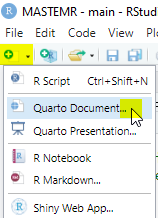
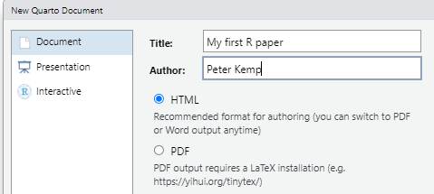
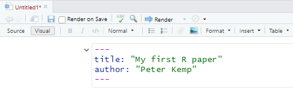
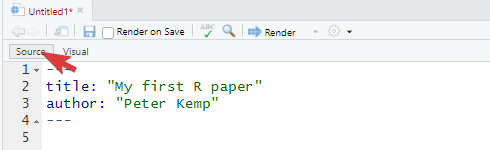

```{r setup}
library(tidyverse)
library(arrow)

```

# Why Quarto

It can be rather annoying having to use multiple programs to create a single journal article, for example you might get your statistics from one program and your graphs from another. If some of your data changes you then have to copy and tables and graphs which can be time consuming and require a lot of fiddling to get things looking just right. By using _Quarto_ files, RStudio allows you to write everything in the same place, bringing together code, graphics and writing, so any changes to any part of your work will be automatically merged together. You can even combine \LaTeX with your writing.

Quarto is pretty new, so you might find that searching for help to do things in *rmarkdown* (the older version of Quarto), will give you the support that you need. The examples here will help you create a simple website that can also be exported as a pdf. Quarto also allows you to create Powerpoints and Word docs.

# Starting a quarto page

In RStudio, click on the `+` icon to add a new `Quarto Document` to your project:



Fill in details about your project and keep it as HTML, we can change this later:



You will see a visual editor, you can use this like a very simple version of MS Word, but we are going to look at using the source editor as this allows for more precise editng of the page



Click `Source` to switch to the plain text editor



The area between the `---` symbols is `YAML` code that defines how your page will be displayed. The area below the final `---` is where we will do our writing:

::: question
Create your own webpage
:::

## Formatting text

You can write a `.qmd` file much like you would write a plain text document by using the toolbar in the visual editor:


But quarto also allows basic formatting using a language called _markdown_. Markdown lets you have basic text formatting of the sort you would have in a journal article, including text that is **`**bold**`**, *`*italic*`*and [`<u>underlined</u>`]{.underline}, it allows for linking actions, such as hyperlinks to [webpages](https://en.wikipedia.org/wiki/Main_Page) through `[webpages](https://en.wikipedia.org/wiki/Main_Page)` and inserting images ``


Make sure that your images are all saved in an `images/` folder in your project folder, and that the address you use includes the image type, here it is `images/brock.jpg`. Try to give your images sensible names or place the images for your chapter in a subfolder of the images folder, e.g. `images/chpt4/amy.jpg`.

::: question
-   Add some text to your webpage with **bold** and *italic* text.

-   Include some hyperlinks

-   Add an image (with a caption!)
:::

## Structuring your page

When writing larger documents you will need to break your page into sections using headers and use features such as lists.

`# This is top level header`

`## This is a sub header`

`## This is an even smaller sub header`

For something that might be less important, you can have multiple levels of subheading by adding more `#`s, for example `#####` would be a level 5 heading, the more `#`s you have the smaller the heading.

```         
-   this is a list 
-   of bullet pointed 
-   created by 
-   items, which can be     
    -   indented with four spaces     
    -   before the hyphen `-`
```

-   this is a list
-   of bullet pointed
-   created by
-   items, which can be
    -   indented with four spaces
    -   before the hyphen `-`

```         
1.  numbered lists
2.  by using numbers followed by
3.  bullet points
4.  You can embed [links](https://stackoverflow.com/questions/73066792/how-to-create-lettered-lists-using-quarto) in lists
```

1.  numbered lists
2.  by using numbers followed by
3.  bullet points
4.  You can embed [links](https://stackoverflow.com/questions/73066792/how-to-create-lettered-lists-using-quarto) in lists

::: question
-   Add a top and sub level heading

-   Add a list
:::

## Quotes and references

If someone has said something interesting, you can block quote them by using the right arrow: \> _quote goes here._

> Dirt glitters as long as the sun shines. -- Goethe

If you want to find out more about how to format your writing in quarto take a look at one of the [helpsheet](https://www.rstudio.com/wp-content/uploads/2015/03/rmarkdown-reference.pdf) or the [help website](https://quarto.org/docs/authoring/markdown-basics.html)

When writing you might want to add academic references to your quarto document. This is very straight forward using `bibtex` - a structured way of recording references. You can find bibtex entries for most academic references through the Google scholar *cite* menu:


You can also [hand-craft](https://en.wikibooks.org/wiki/LaTeX/Bibliography_Management#BibTeX) your own references if you can't find them online.

Once you have your bibtex code, place it in a file called `references.bib` (or similar). Make sure that you know where your `.bib` file is. In the code below we are placing this file in the same folder as our `.qmd` file. Go and edit the YAML at the top of your quarto page and point the `bibliography:` variable at the `.bib` file you have made

```         
---
title: "Article about things"
author: "Peter Kemp"
format: html
bibliography: references.bib
---
```

To add references to your work you need to `@` the name of the reference, this name is at the top of each bibtex entry, in the example below `@kuhn1970structure`:

```         
@book{kuhn1970structure,
  title={The structure of scientific revolutions},
  author={Kuhn, Thomas S},
  volume={111},
  year={1970},
  publisher={Chicago University of Chicago Press}
}
```

To add this reference to your writing use `@kuhn1970structure` to get @kuhn1970structure, use `[@kuhn1970structure]` to get [@kuhn1970structure]. If you just require the year use `[-@kuhn1970structure]`: [-@kuhn1970structure]. If you want to include multiple references together, use the `;` inside the square brackets `[e.g. @kuhn1970structure; @stoet2018gender]`: [e.g. @kuhn1970structure; @stoet2018gender]. To refer to a particular page number use `[@kuhn1970structure pp.70]` to get [@kuhn1970structure pp.70].

All your references will be automatically included at the bottom of the website (go check them out!) and students can quickly access reference information by hovering over the references inline in the text. Depending on the fields you provide and the format, e.g. @book and @article, the references will display differently.

::: question
-   Save three references to a bibtex file
-   Include the references in your writing
:::

## Rendering your page

Now you have fleshed out your first page you are going to `render` it. To do this, click on the `Render` button:


This should then output a webpage with all your work on it. You are probably more used to outputting pdfs or Word Docs. We can change the output of the project by editing the YAML in `Source` mode, changing format from `html` to `pdf` will then allow you to output a pdf when you click render

```         
---
title: "Quarto help"
author: "Peter Kemp"
format: pdf
bibliography: references.bib
---
```

::: question
Render your project as a website, a pdf and a Word doc
:::

# Embedding code

So far you have seen how to edit a simple looking page and you're probably thinking that this is no way as good as your word processor of choice. Where quarto comes into its own is allowing you to combine R code outputs and writing. This has a few benefits:

-  You don’t need to keep copy and pasting code and results from R to a Word doc
-  If the underlying datasets change any changes automatically filter through
-  It’s easy to include the code that you use so reviewers can see exactly what you have done
-  Other researchers can copy and adapt your code for their own projects.

To add a code chunk we need to place it in a `code chunk` which is the space between the ```{r} and ``` lines, the results will be automatically displayed below the code:

```{r}
#| echo: fenced
1 + 1
```

Data objects can be created, shared and rewritten, starting at the top and moving down in your document:

```{r}
#|  echo: fenced
# This is where I do my calculations
ans <- 2 + 9
```

And now I decide to print it:

```{r}
#| echo: fenced
print(ans)
```

Code blocks have [settings](https://quarto.org/docs/reference/cells/cells-knitr.html) that change how they function, you might want to hide all your code and only output the results, you might want to show your code, but not run it.  To do this we can pass variables to the code chunks through the use of `#| setting: value` that tell quarto how to handle each chunk. For example, by adding `#| eval: false` to the top of the code chunk. The code then displays, but doesn’t run (evaluate):

```{r}
#| eval: false
#| echo: fenced
starwars %>% 
  head(3)
```

Alternatively, we might use `#| eval: true` and `#| echo: false` to display the results, but not the code (code shown here for you to see how this is done!).

```{r}
#| eval: true
#| echo: false
#| echo: fenced
starwars %>% 
  head(5)
```

Other code chunk variables include:

- `warning:` # suppress or show warning messages attached to a piece of code
- `echo:`  # include the code in the output
- `error:` # show code even if there is an error in it
- `eval:`  # run the code and display the output

## Inline code

Often when we are writing papers we want to _inline_ the results, i.e. putting the results into paragraphs of text. To do this we can use the `\`r CODE GOES HERE \`` commend. You could use a code chunk to calculate the mean of a value and store it in an object `mean_score`, to get this into your paragraph you would write `\`r mean_score \``

## Loading datasets

You can have code chunks in any section of your `.qmd` file after the `YAML`. To keep things neat you might consider loading and manipulating your datasets right after the YAML, you can then access them inline or in other code chunks throughout your document

```         
---
title: "Quarto help"
author: "Peter Kemp"
format: pdf
bibliography: references.bib
---
\`\`\`{r setup}
library(tidyverse)
library(arrow)
library(gt)

PISA_2018 <- load_parquet("PISA_2018.parquet")
num_students <- nrow(PISA_2018)
mean_maths <- mean(PISA_2018$PV1MATH, na.rm=TRUE)
UK_students <- PISA_2018 %>% 
                select(CNT, PV1READ, ST004D01T) %>%
                filter(CNT == "United Kingdom") %>%
                group_by(ST004D01T) %>%
                summarise(mean_read)
\`\`\`

This report looks at \``r nrow(PISA_2018)\`` students who got a mean maths score of \``r mean_maths`\`. If you want to see how UK students did in their reading test, see this:

\`\`\`{r}
UK_students %>% 
ungroup() %>% 
gt()

\`\`\`

```


``` question


```

## Showing tables

Manually making tables can be rather [fiddly](https://quarto.org/docs/authoring/tables.html) in quarto, and you might find it easier to use the WYSIWYG feature of the visual editor. If you want to print a dataframe into your report, the library `gt` does an excellent job, allowing you to adjust rows, format values, change headings, add captions, etc. To get `gt` to work, you need to pipe your dataframe to the `gt()` function. We also use the code chunk variable `#| tbl-cap:` this allows you to add a caption to the table, which will appear in any table listings.

```{r}
#| eval: true
#| echo: fenced
#| tbl-cap: "Some Star Wars data"
starwars %>% 
  head(10) %>%
  select(name, height, mass, hair_color, sex) %>%
  gt() %>%
  data_color(columns = sex,
             palette=c("Green", "Blue", "Gray", "White"),
             levels=c())
```

## Showing graphs

`ggplot` allows for some great graphs and often copy and pasting them from R into a word document can be fiddly and mess up aspect ratios. A much neater way is to output your graphs directly into your reports. We use the code chunk variable `#| fig-cap:` to add a caption to the figure, which will appear in any figure listings.`#| fig-width:` allows you to manually set the figure width, leaving this out will let R automatically set the width for you.

```{r}
#| eval: true
#| echo: fenced
#| fig-cap: "age and height"
#| fig-width: 3
library(ggrepel)

ggplot(data=starwars, aes(x=height, y=birth_year, colour=sex)) + 
  geom_point() + 
  geom_text_repel(aes(label=name))
```

``` question
Using `PISA_2018` add a table and a graph to your report. Make sure you specify captions.
```
